# Working with Flow control, Variables, Expressions and Loops

In this lab, you will create a cloud flow using a Power Automate to work with Flow control, Variables, Expressions and Loops.

* `Learning objectives`: Flow control, expressions, variables, using Date/Time Duration: 50 minutes.
* `Scenario`: We have a list of offices in an Excel sheet. Create a Flow that will send a report describing this list of offices, including the biggest office.
* `Prerequisites` - Each student must have a dedicated excel sheet __Offices.xlsx__. This list was will be imported diring the first task of this lab.


## Task 1

a. Create an Excel workbook and a scheduled flow. The [Offices.xlsx](/labs/cloudflows/advanced/loops/resources/Offices.xlsx) excel is available in the resource section of this lab. Upload this spreadsheet in your onedrive for business.

b. This document contains the list of offices of Contoso Corp. Each office has a limited number of seats.Every month a report  describing the list of offices and the total number of seats is sent to the management (in this case the management is...yourself). The e-mail should look like this:

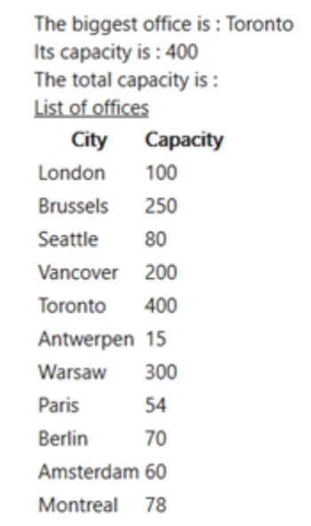


c. Create a flow to generate this e-mail report.
- Create a __New flow__ > __Scheduled cloud flow__
- Use the following screenshot to name the flow, and set the flow frequency.

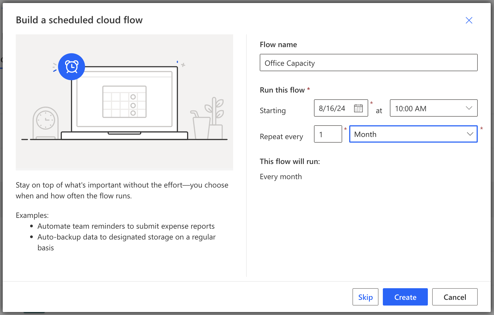

d. Click __Create__. The following flow will be generated:

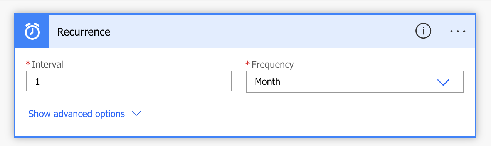


e. The first challenge will be to define the __Total capacity__. Use the following steps to create a variable that will contain that value.
- Select New Step and select __Initialize variable__:

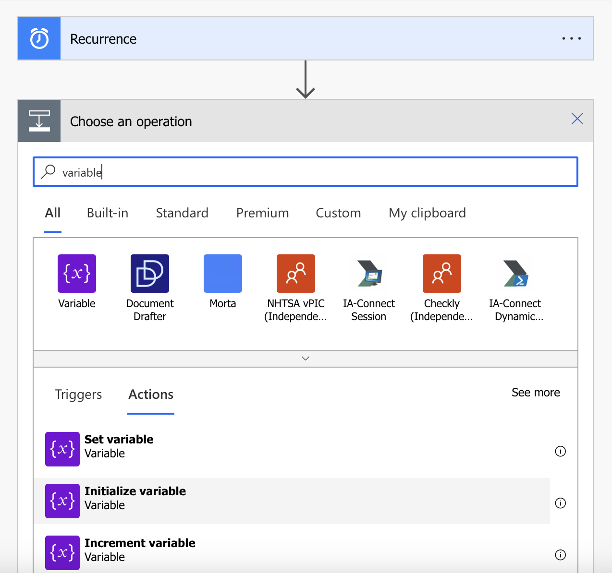

f. Rename this action to __Initialize variable Total capacity__, set the variable name __Total Capacity__, and select __Integer__ as the type with an initial __Value__ of `0`:

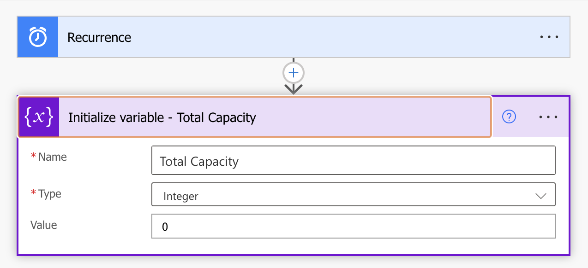


## Task 2
__Extend the flow to loop through all offices__: In this task, you will make it loop through all offices, retrieve their capacity, and increment the Global Capacity variable to calculate the total capacity.

a. To retrieve the list of offices.
- Select __New step__ > __Excel Online__ > __List rows present in a table__:

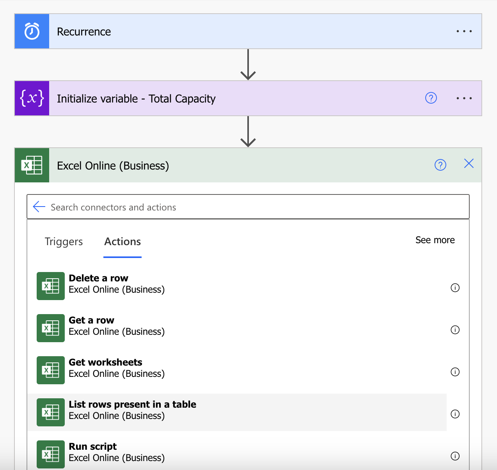

b. Set the Excel action’s properties as per the following screenshot:

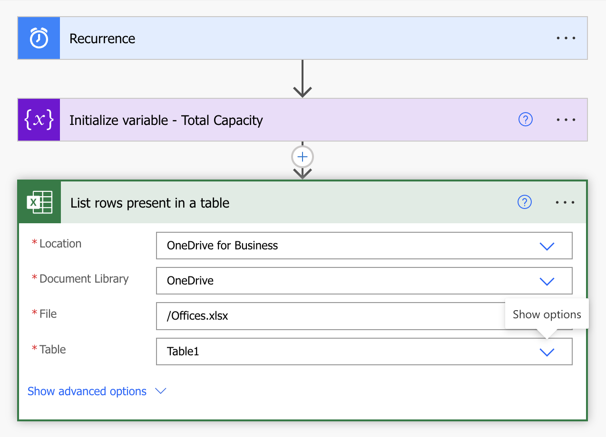

c. Click Show Advanced option and type __capacity DESC__ in the __Order By__ field:

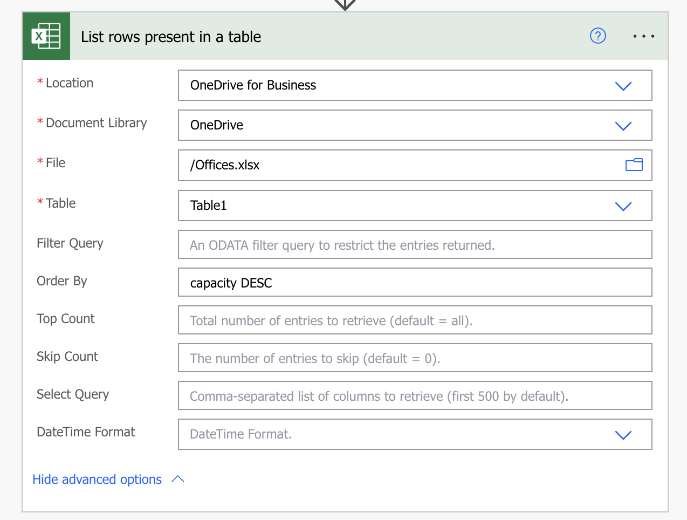

d. Add the __Apply to each__ action (it expects a list of values), using the ”Add a dynamic value” to select the __value__ property from the __List rows present in a table__ action.

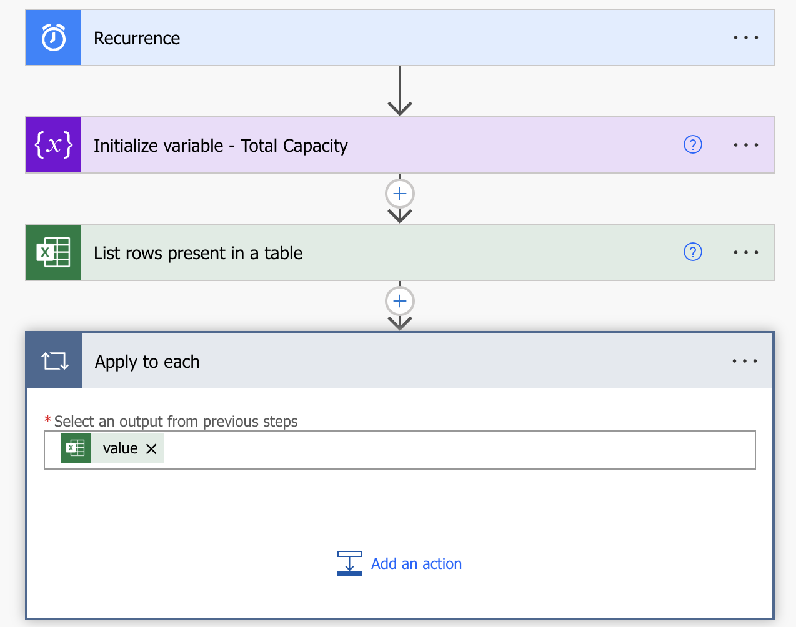

e. Calculate the current office capacity using a variable and an expression.
- In the __Apply to each__ action, click __Add an action__ > __Increment variable__:
- In the __Name__ drop-down list, select __Total capacity__, and rename the action:
- Click inside the __Value__ text box, and click the __Expression__ tab to add an expression
- Type the following expression: and don’t forget the click Save: __int(item()?['capacity'])__


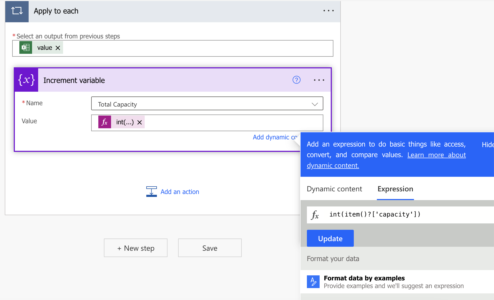


> __Note__ : The item() expression retrieves the current record information in the current loop, and [‘Capacity’] provides the field name to retrieve. Item()[‘Capacity’] returns a string. The question mark ? makes your code more robust by avoiding it crashing if there is no such field (here ‘capacity’) in the record. 


> __Note__ : The information coming from Excel is a string, and we need to transfer it as a number to increment it to the variable Total capacity. To transform a string to an integer (), we use the int() function.


> __Note__ : There are many other expressions available in Power Automate, and we encourage you to read the documentation related to expressions after doing the labs. You can start from the following [web page](https://powerautomate.microsoft.com/en-us/blog/use-expressions-in-actions/). The list (reference) of all functions can be found [here](https://learn.microsoft.com/en-us/azure/logic-apps/workflow-definition-language-functions-reference)


f. To test the flow, without waiting one month before it starts, __Save__ the flow and use the Test button to manually start the flow on demand (in test mode). This is convenient for testing and debugging purposes.
- Click __Test__.
- Wait until you get the message: __Your Flow ran successfully__.
- To check the Total Capacity value, you can examine the value of Total capacity for each step. For example, in our case, we will check its value once it has completed the loop 11 times: so, type 11 In the Show textbox
- Click Increment variable – Total Capacity to display a value of 1607 (if you use the values in the Excel workbook as defined at the beginning of the lab.

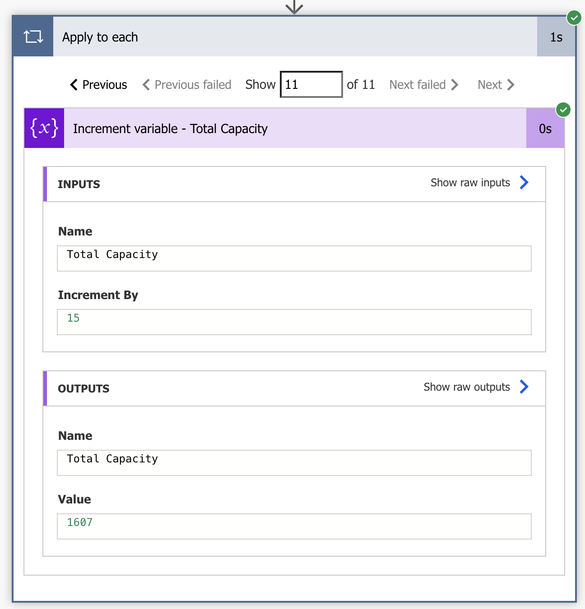


g. Define 2 new variables below the variable, __Total capacity__ and before the __Apply to each__ loop, add two new __variables__ named:
• __Biggest office__ (type string)
• __Biggest capacity__ (type integer)

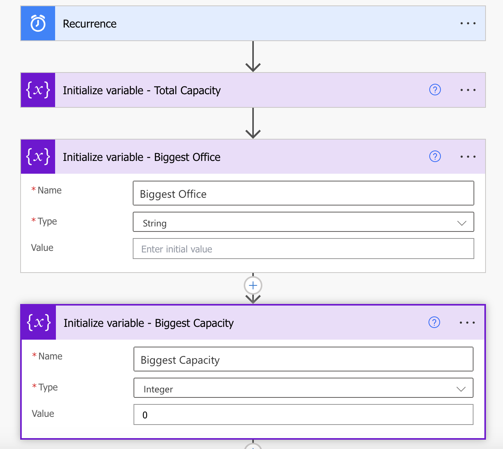

h. Add a __Condition__ (from the Control connector) in the __Apply to each__ action. The goal is to compare two numbers and select the larger one. To do so we need to transform our capacity values into __integers__. 
- On the left side of the condition, click __Choose a value__ and click on __expression__. As we already did it before, type __int(items()?['Capacity'])__
- Select the comparison operator __is greater than__:
- In the Choose a value textbox, select the Dynamic value – __Variables__ – __Biggest Capacity__
- Now, in the left If __yes__ branch, add a new action __Variables__ – __Set variable__ for our __Biggest Capacity__ variable.
- Rename the action __Set variable – Biggest Capacity__:
- click __Choose a value__ and click on __expression__ type __int(item()?['capacity'])__


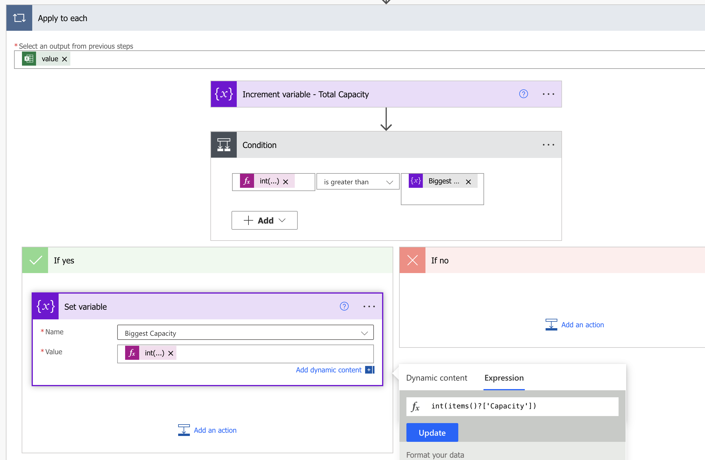

i. In the same left branch of the __condition__, add another __set variable__ action and select the variable __Bigger Office__ and assign it a value of __city__. Click on the __Dynamic value__ button to retrieve __city__.

> Or, as an alternative, you can create an expression with __item()?[‘city’]__


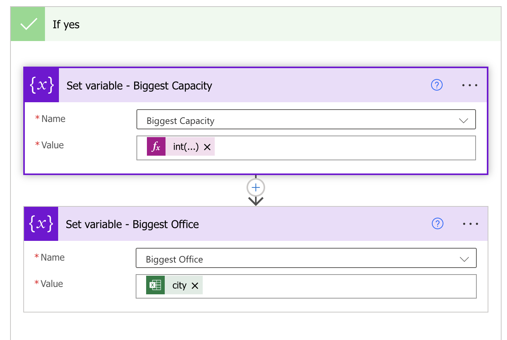

j. Save and test the flow to determine which city has the bigger capacity (Toronto in our case). You can debug the flow or add a notification (or send an e-mail to yourself).


## Task 3

a. Next, let’s send an e-mail by adding an __Office 365 Outlook – Send an e-mail (V2)__ action after the __Apply to each__:
- Find the action by typing __Outlook__
- In the Connectors list click Office 365 Outlook:
- Select the action Office 365 Outlook – Send an e-mail (V2)

b. Fill-in the Send an e-mail action with the following values:

* In the To field provide your e-mail address
* In the Subject, type “Office Capacity Report.”
* In the body type the following text:

The biggest office is: __Biggest Office__ (from dynamic content)
Its capacity is: custom expression - string (dynamic content for __biggest capacity__)
The total capacity is: custom expression - string (dynamic content for __total capacity__)

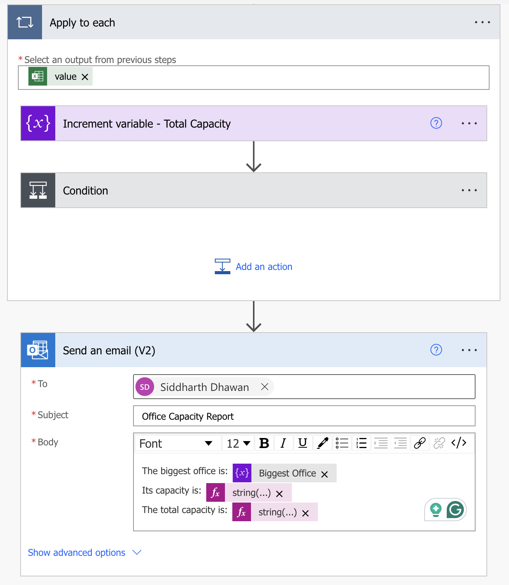

c. __Save__ and __Test__ your flow.


## Task 4

In the following steps, we will display the list of offices, so we will have to define a list formatting logic and create an HTML table based on this logic.

a. Let’s define the list formatting logic. Before the __Send an e-mail__ action, add a __Data Operations__ – __Create HTM table__ action:
- From: __value__ (dynamic content from __List of items__)
- Columns: __Custom__
- Header values: __City__ and __Capacity__
- Value: Dynamic content for __City__ and __Capacity__


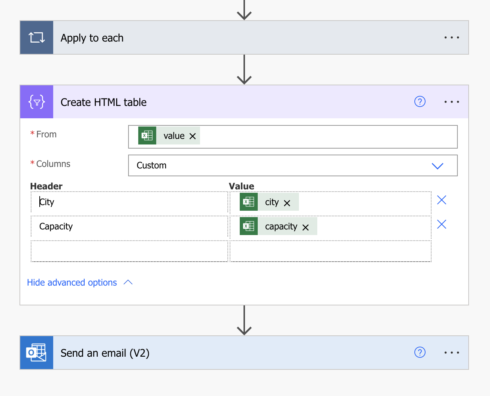

b. Go back to the Send an e-mail action and update the Body text box to include the Create HTML Output value: 
- Type __The Total list of offices is :__ and add the output of The create HTML table action.


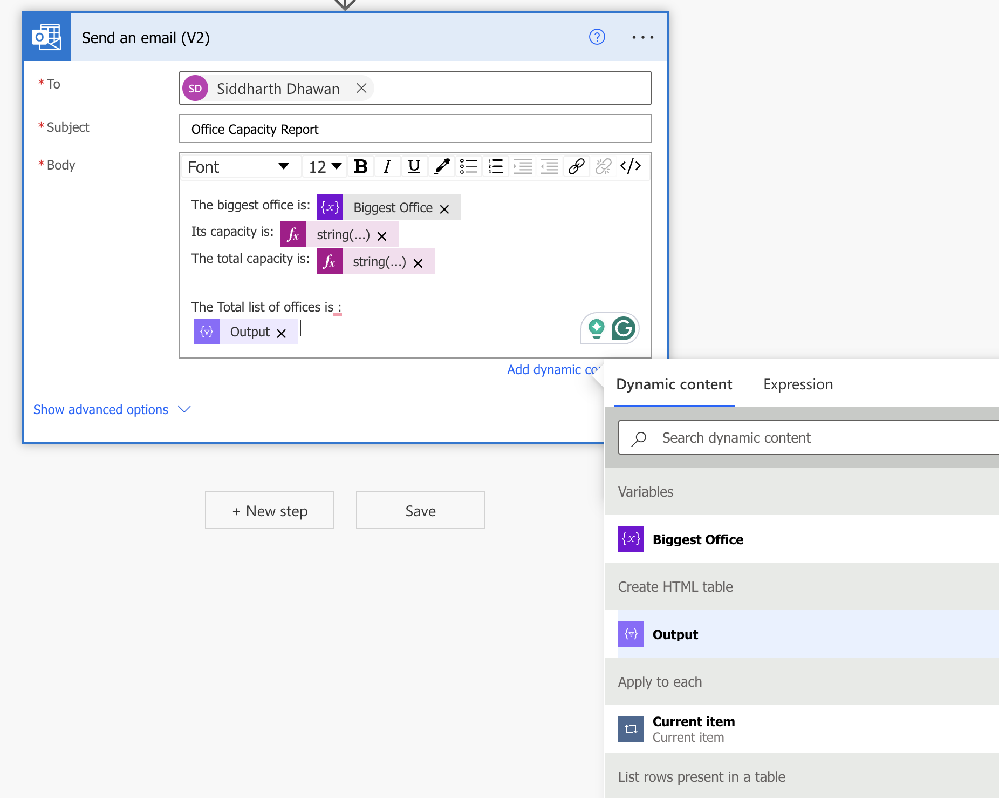


c. __Save__ and __Test__ your flow.


## Task 5 - Exercise

Let’s extend our flow by adding a new column named Size in our report: the logic is that __if the quantity is smaller than 100, we would like to see “Small”, otherwise we will see “Big”__.

The report must look like:

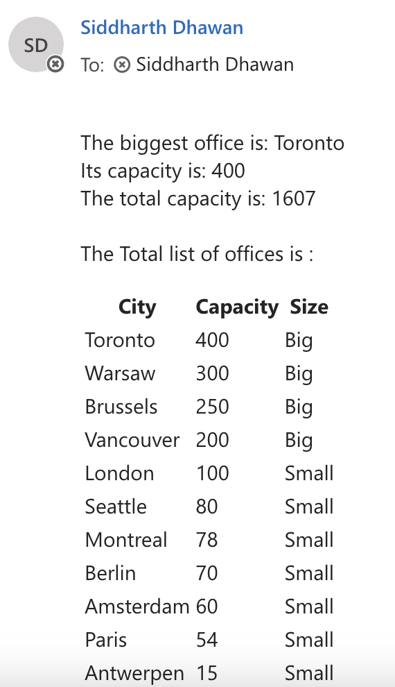

<details>
  <summary>Not sure how?</summary>

```
You will need to use the folloiwng functions __if()__ and __greater()__. The __expression__ is :

if ( greater(int(item()?['Capacity']), 100),'Big','Small')
```

</details><br/>