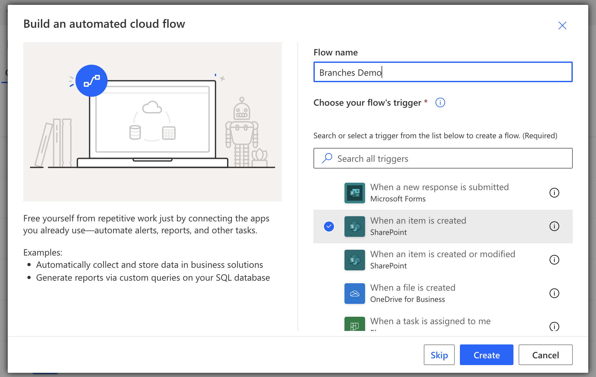
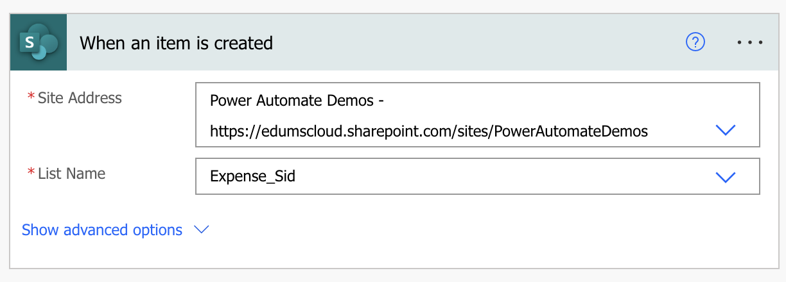
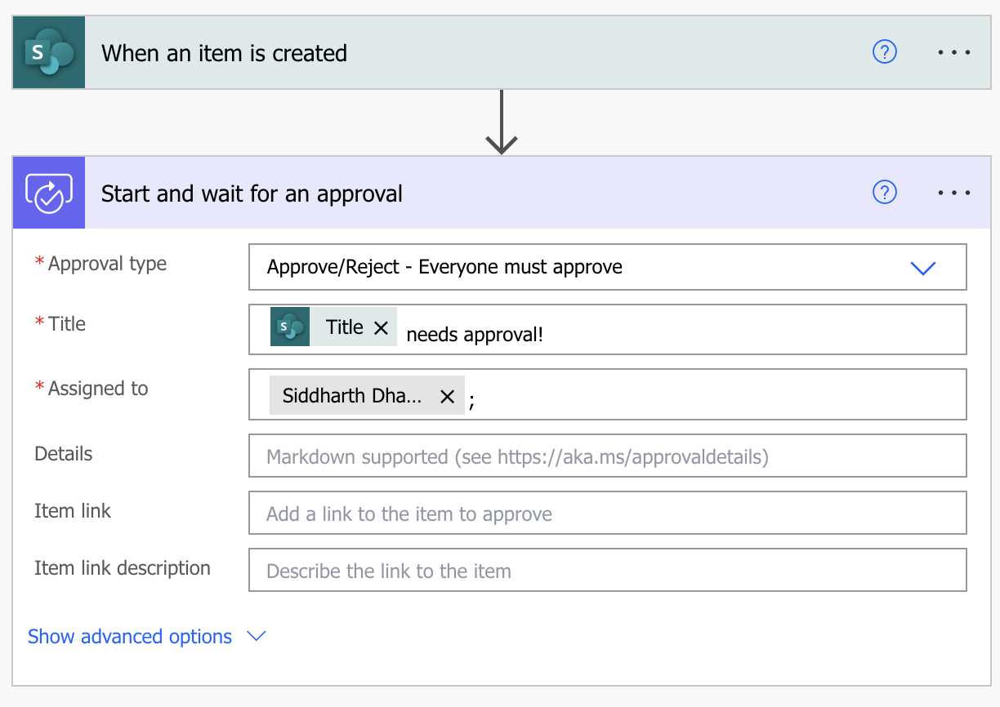
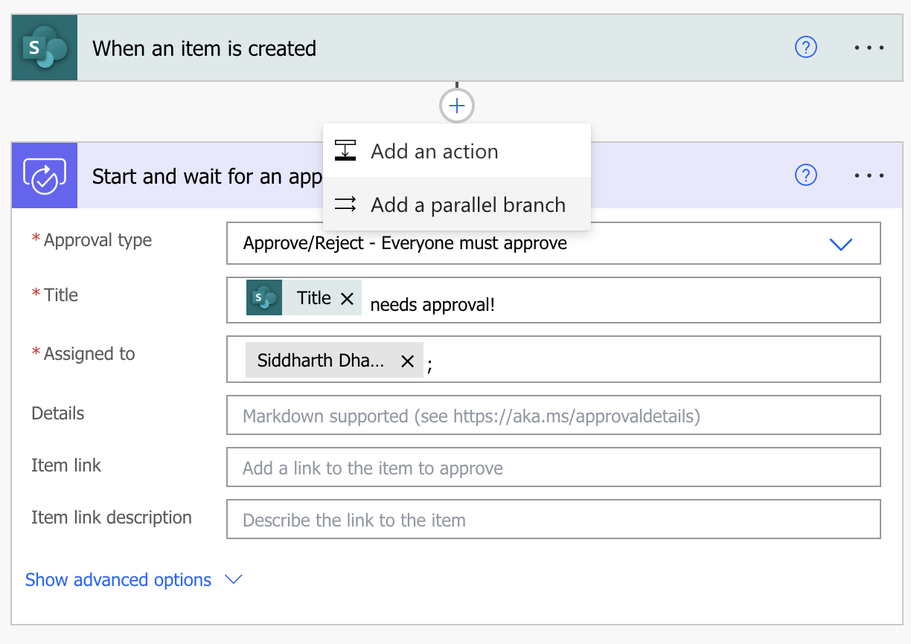
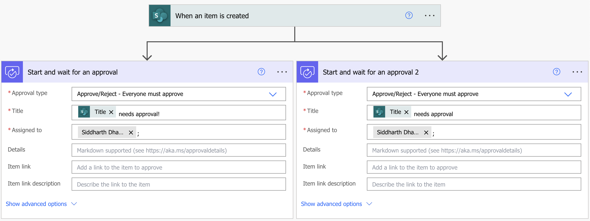
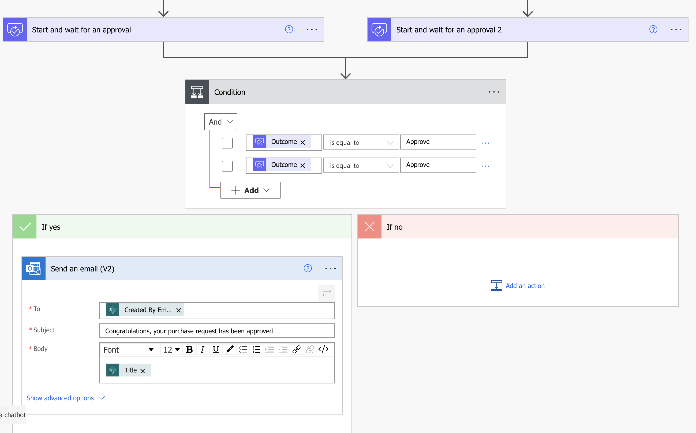

# Branches Demo

## In this Lab

In this lab, we will trigger parallel approvals when a SharePoint list item is created.

* `Learning objectives`- Branches in Cloud Flow
* `Duration` - 10 minutes
* `Scenario` - Trigger parallel approvals when a an item is created in a SharePoint list.
* `Prerequisites` - Each student must have a dedicated custom SharePoint list named __Expenses-your-name__. This list was already created during the lab.

## Task 1

a. Create an automated cloud flow with a trigger for __When an item is created__

The trigger will look like this:

b. Now, we need to create parallel approvals. Branches can help us achieve this. To create a branch, we need to create an action first:
- Approval Type: Everyone must approve
- Title: __Title__ from dynamic content
- Assigned to: __your-email__

c. Add a parallel branch by clicking on the __+__ button after the trigger > __Add a parallel branch__

d. Add another approval with the below parameters:
- Approval Type: Everyone must approve
- Title: __Title__ from dynamic content
- Assigned to: __your-email__

By now, your flow will look like this:

e. __Save__ your flow.

## Task 2 - Exercise

### We want to send an email to the person creating the purchase request if both the approvers (in this case, yourself) __Approve__ the request.

  
Not sure how?

 

