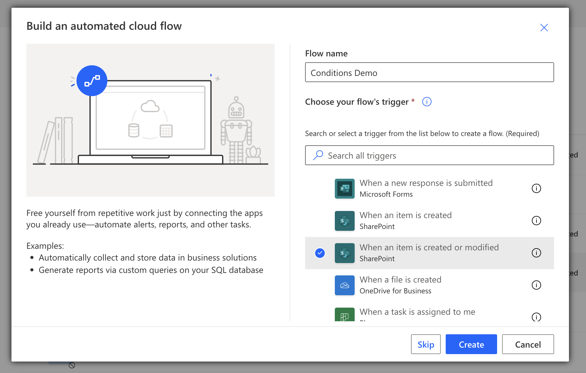
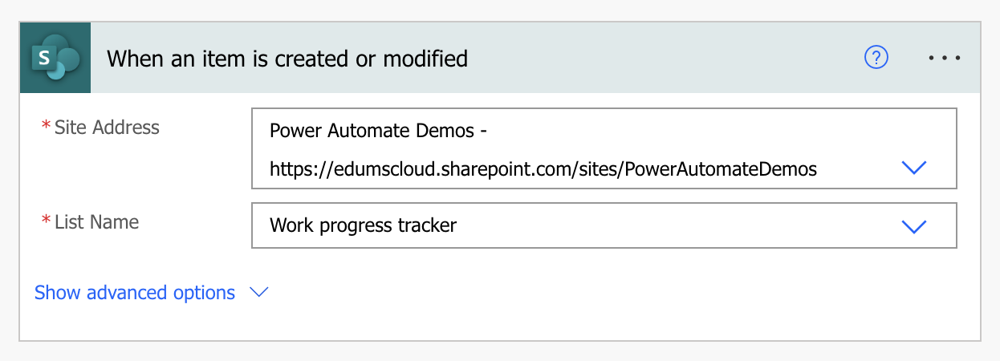
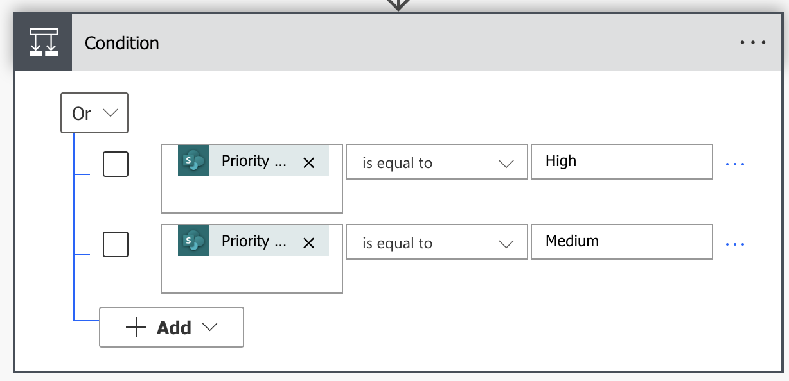
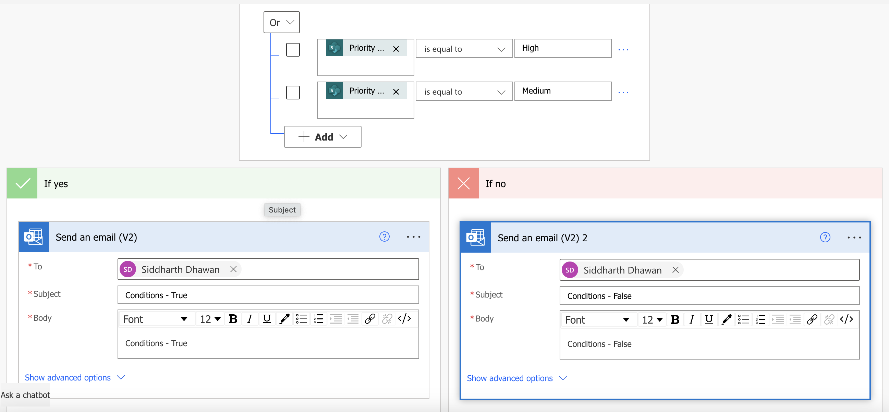
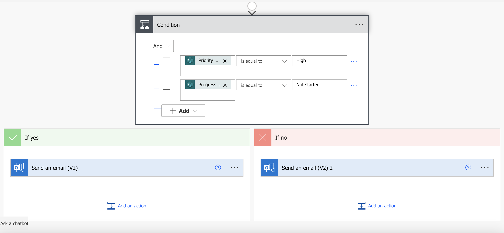
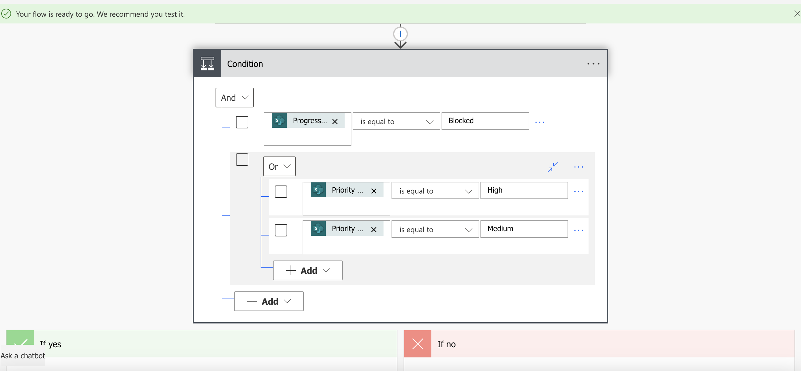
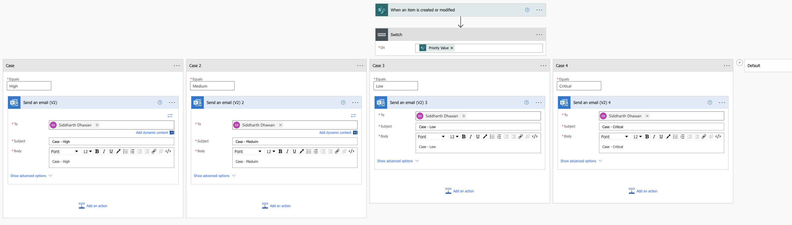

# Conditions and Switches inside Power Auromate

Use a __condition__ to specify that a cloud flow performs one or more tasks only if a condition is true or false.

The __Switch__ function evaluates a formula and determines whether the result matches any value in a sequence that you specify. If a match is found, a corresponding value is returned. If no match is found, a default value is returned. In either case, the returned value might be a string to show, a formula to evaluate, or another form of result.

If and Switch are very similar, but you should use the best function for your situation:

* Use If to evaluate a single condition. The most common syntax for this function is If( Condition, ThenResult, DefaultResult ), which provides the common "if … then … else …" pattern seen in other programming tools.
* Use If to evaluate multiple unrelated conditions. In Power Apps (unlike Microsoft Excel), you can specify multiple conditions without having to nest If formulas.
* Use Switch to evaluate a single condition against multiple possible matches. You can also use If in this case, but you'd need to repeat the formula for each possible match.

## In this Lab

In this lab, you will create a cloud flow using a Power Automate to work with conditions and switch functions.

* `Learning objectives`- Conditions and Switches
* `Duration` - 20 minutes
* `Scenario` - Send an email based on the conditions and switches on when a an item is created or modified in a SharePoint list.
* `Prerequisites` - Each student must have a dedicated custom SharePoint list named __Work Progress Tracker__. This list was already created during the basic flow lab.

## Task 1

a. Create an automated cloud flow called __Conditions Demo__ and the trigger would be __When an item is created or modified__ (SharePoint list)

b. Configure the SharePoint trigger:
- Site Address: https://edumscloud.sharepoint.com/sites/PowerAutomateDemos
- List Name: Work progress tracker

c. Add a new condition - if __Priority Value__ __is equal to__ __High__ OR __Priority Value__ __is equal to__ __Medium__.

d. Add a __Send an Email(v2) action for the True and False Branches:

e. __Save__ and Test the flow.

* Modify an item in the __Work Progress Tracker__ SharePoint list.
* Verify the email based on relevant conditions.

## Task 2

a. Modify the condition - if __Priority Value__ __is equal to__ __High__ AND __Progress Value__ __is equal to__ __Not started__.

b. __Save__ and Test the flow.

* Modify an item in the __Work Progress Tracker__ SharePoint list.
* Verify the email based on relevant conditions.

## Task 3

a. Modify the condition - 
if __Progress Value__ __is equal to__ __Blocked__ 
AND
if __Priority Value__ __is equal to__ __High__ OR __Priority Value__ __is equal to__ __Medium__

b. __Save__ and Test the flow.

* Modify an item in the __Work Progress Tracker__ SharePoint list.
* Verify the email based on relevant conditions.

## Task 4

a. Replace the __If__ condition with a __Switch__ statement of the __Priority Value__
- Case 1 equals __High__ > Send email to yourself with subject __Case High__
- Case 2 equals __Medium__ > Send email to yourself with subject __Case Medium__
- Case 3 equals __Low__ > Send email to yourself with subject __Case Low__
- Case 4 equals __Critical__ > Send email to yourself with subject __Case Critical__

b. e. __Save__ and Test the flow.

* Modify an item in the __Work Progress Tracker__ SharePoint list.
* Verify the email based on relevant conditions.