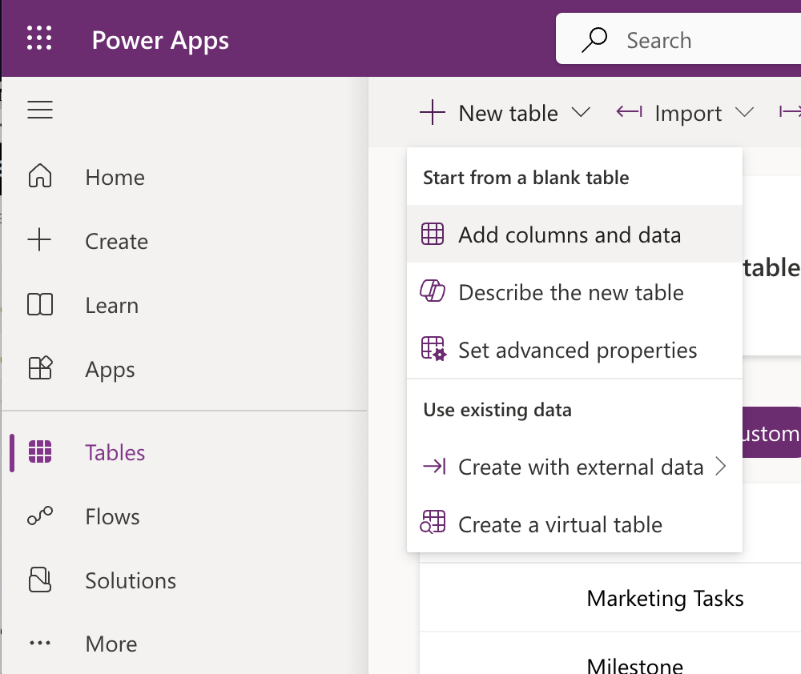
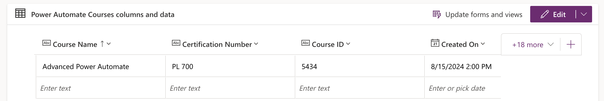
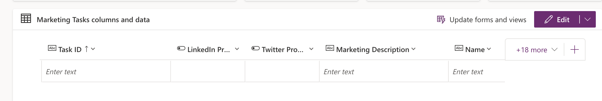
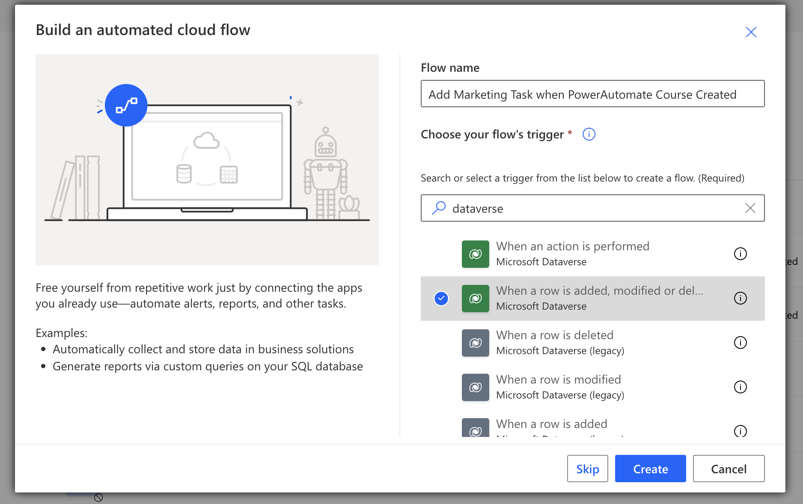
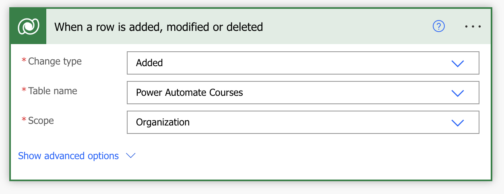
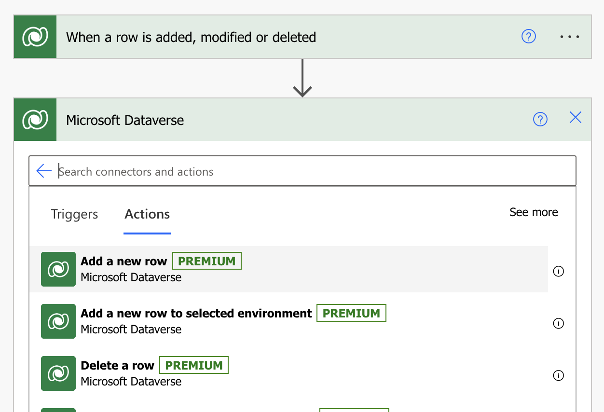
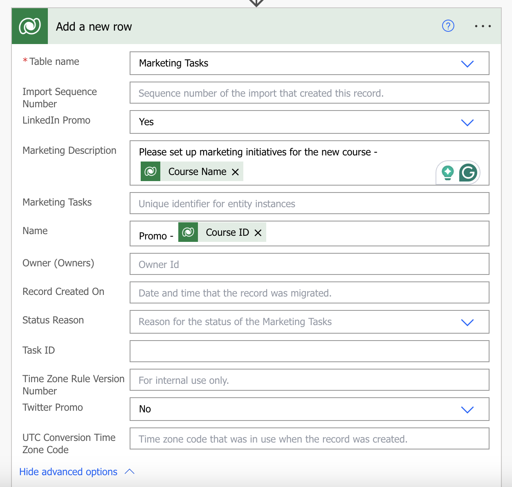
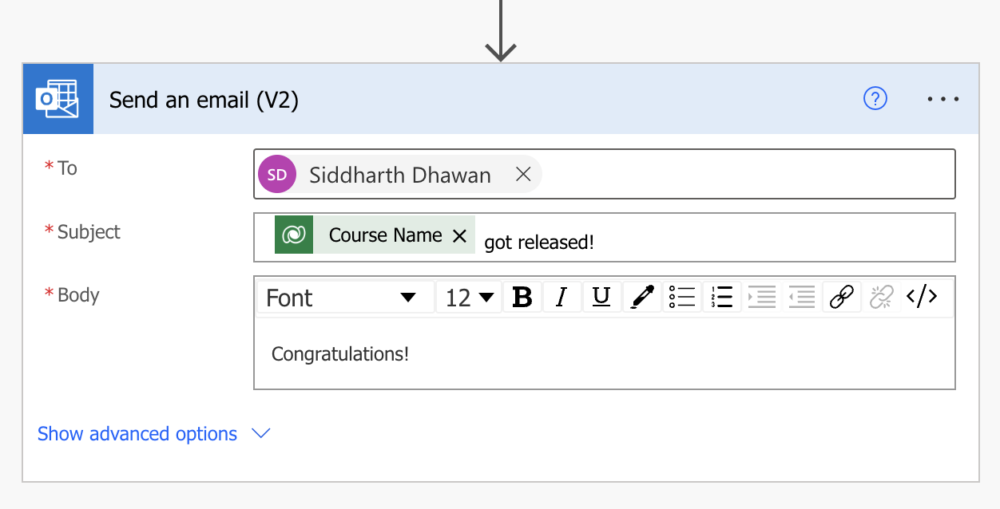
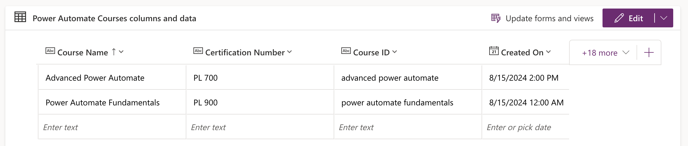
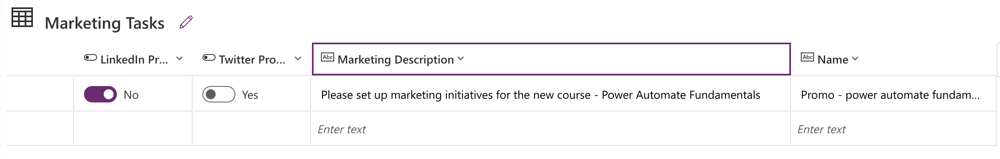

# Add marketing task whe a training course is created

With Microsoft Dataverse, you can store and manage data for business applications and integrate natively with other Microsoft Power Platform services like Power BI, Power Apps, Microsoft Copilot Studio, and AI Builder from your cloud flows.

The Microsoft Dataverse connector provides several triggers to start your flows and many actions that you can use to create or update data in Dataverse while your flows run. You can use Dataverse actions even if your flows don't use a trigger from the Dataverse connector.

Use the Microsoft Dataverse connector to create cloud flows that start when data changes in Dataverse tables and custom messages. For example, you can send an email whenever a row gets updated in Dataverse.

## Overview of triggers
The Microsoft Dataverse connector provides the following triggers to help you define when your flows start:

* When a row is created, updated, or deleted

* When an action is performed

* When a flow step is run from a business process flow

## Overview of actions
The Microsoft Dataverse connector provides the following actions to help you manage data in your flows:
* Create a new row
* Update a row
* Search rows with relevance search
* Get a row
* List rows
* Delete a row
* Relate rows
* Unrelate rows
* Execute a changeset request
* Get file or image content
* Upload file or image content
* Perform a bound action
* Perform an unbound action

## In this Lab

In this lab, you will create a cloud flow using a Power Automate that will update a maekeing Dataverse table 

* `Learning objectives`- Cloud flows using Dataverse
* `Duration` - 15 minutes
* `Scenario` - A record created in a Power Automate Cources tebale will automatically add a row in the Marketing table
* `Prerequisites` - Each student must have a dedicated custom table in. Dataverse tables can be created in the Power Apps developer portal (make.powerapps.com) The student will create this list in the first task of this lab.

## Task 1

Create two new tables - __Power Automate Courses__ and __Marketing Tasks__ in Dataverse using the following steps
* Navigate to __make.powerapps.com__ > + __New Table__ > __Add Columns and Data__> __New Column__

    

* Repeate the above step to create the two tables:

    - __Power Automate Courses__

    

    - __Marketing Tasks__

    

## Task 2

Create a cloud flow from scratch: 

a. Create a new __Automated Cloud Flow__. Name it __Add Marketing Task when PowerAutomate Course Created__. Choose your flow trigger as __When a row is added, modified or deleted__. Click __Create__.

b. Configure the trigger:
- Change Type: Added
- Table Name: Power Automate Courses
- Scope: Organization

c. Add new action. Click on __New Step__ > Search for __Dataverse__ > Select __Add a New Row__.

d. Configure the new action __Add a New Row__

- Table Name: Marketing Tasks (from the list of dataverse tables)
- LinkedIn Promo: Yes
- Twitter Promo: No
- Mareting Description: Please set up marketing initiatives for the new course - __Course Name__ (from dynamic content)
- Name: Promo - __Course ID__ (from dynamic content)

e. Add a new action __Send and email (v2)__

- To: <your-email>
- Subject: __Course name__ released!
- Body: Congratulations!

f. __Save__ the flow

## Task 2

Test the flow:
a. Navigate to the __Power Automate Courses__ table in __name.powerapps.com__.
b. Add a new row to the above table:

c. Validate the new record in the __Marketing Tasks__ table

Also, validate the Congratulations email.
