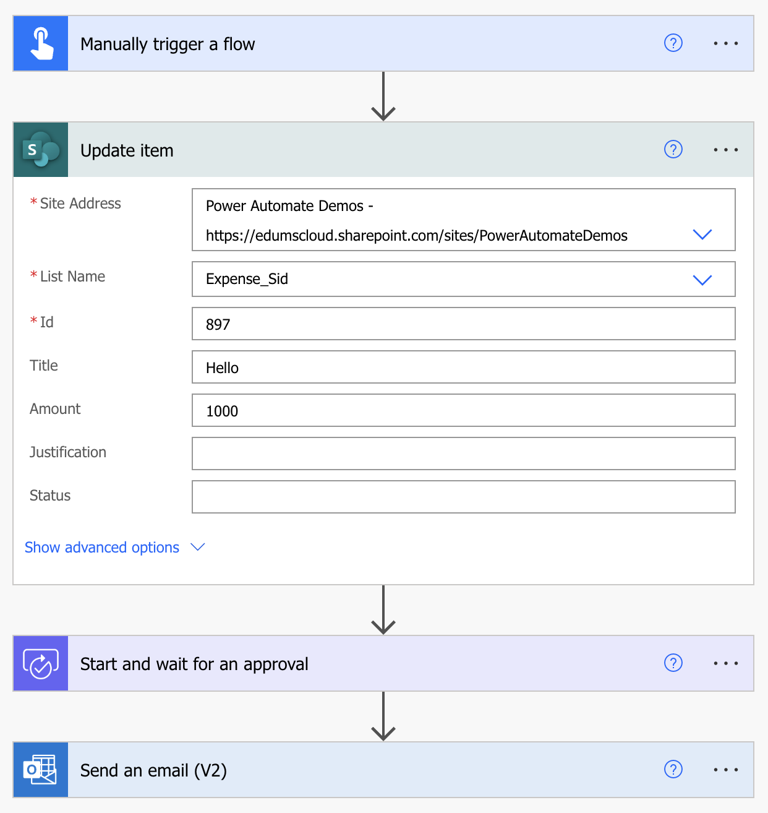
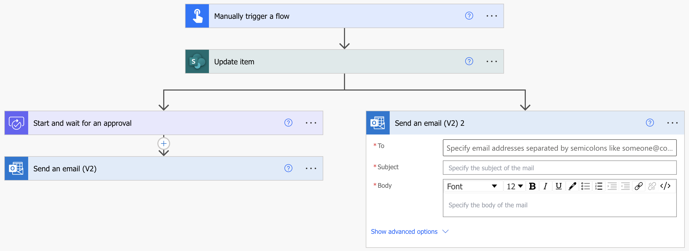
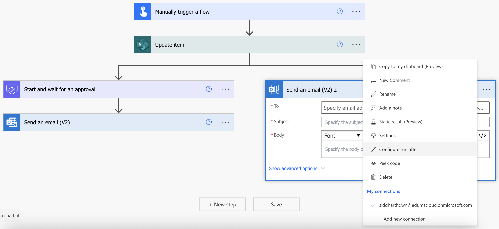
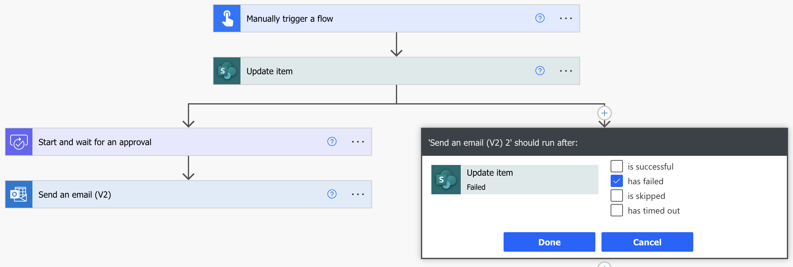
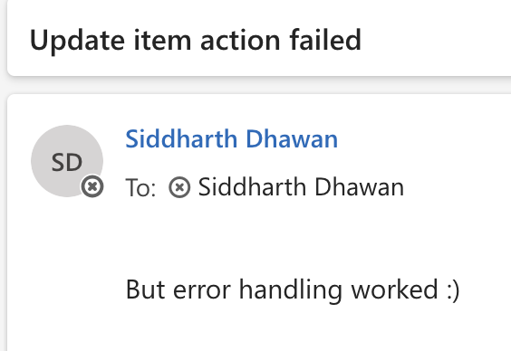
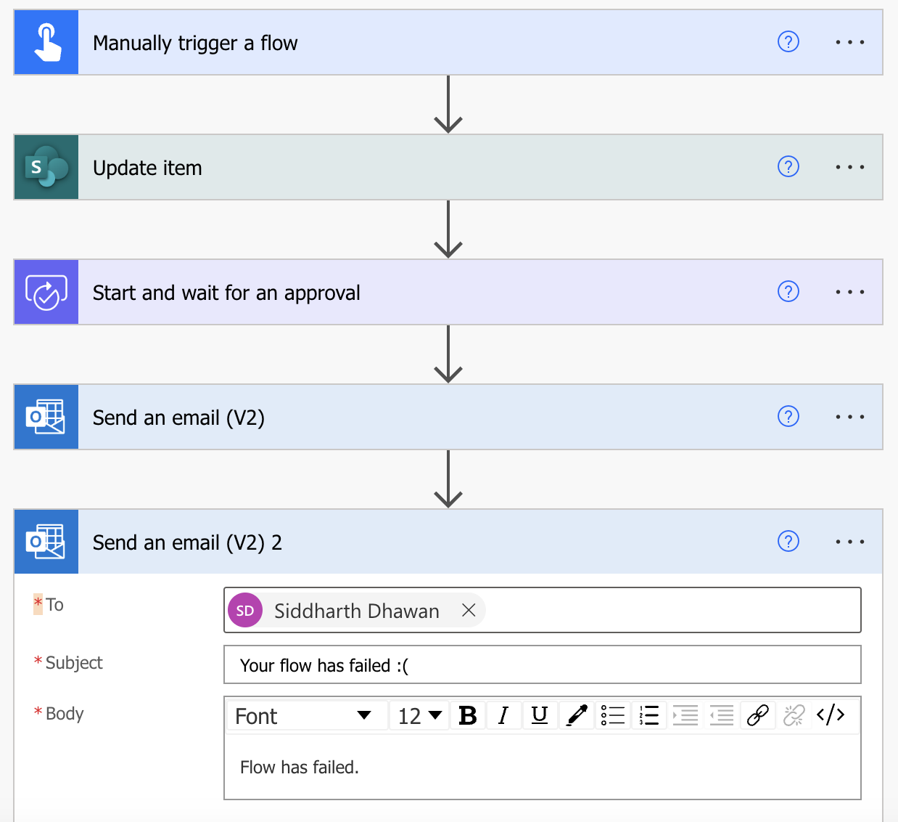
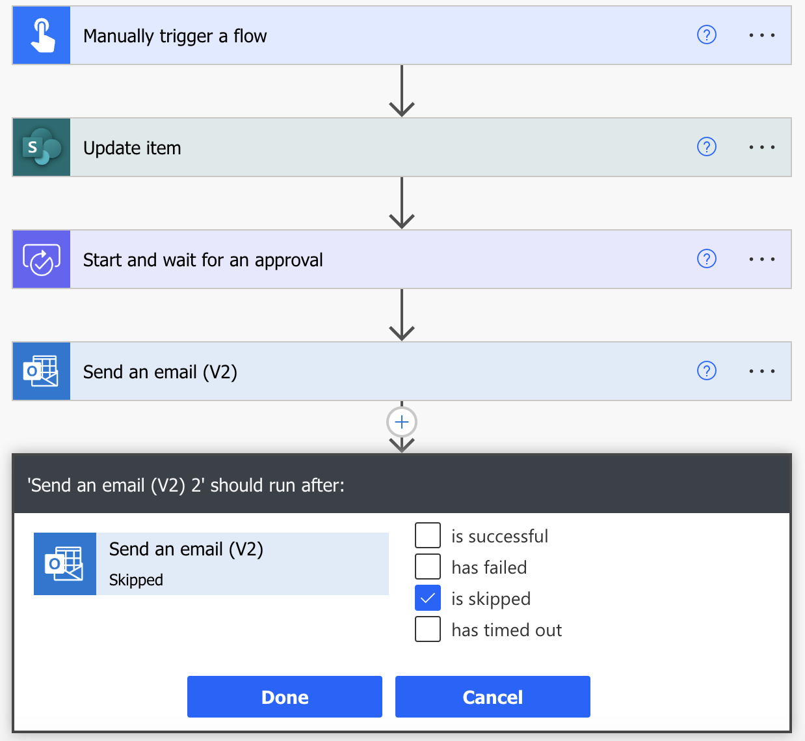
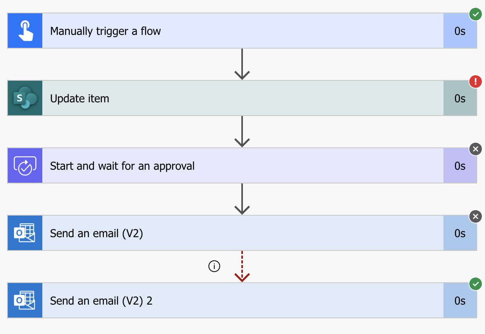
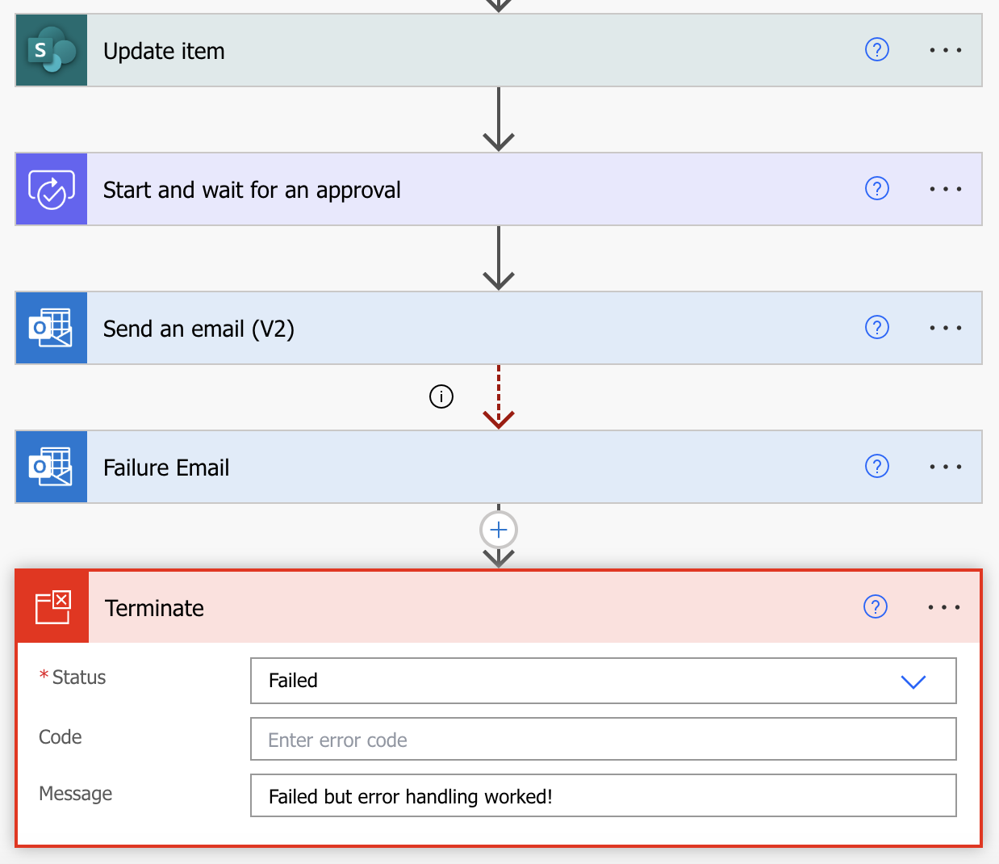
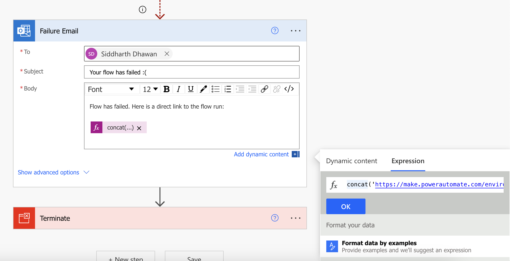

# Error Handling Demo

Getting notifications when your flow has failed because of an error is critical to maintaining business continuity. Also, the notification should provide the cause of the error to help you resolve it quickly. 


## In this Lab

This lab will focus on how you can use Configure run after and terminate flow, options that is available for flow actions, to help isolate errors. It also overviews the built-in error reports.

* `Learning objectives`- Error Handling in Power Automate
* `Duration` - 20 minutes
* `Scenario` - Trigger a flow with induced exception and then manage it using __run after__ and __terminate flow__ options.
* `Prerequisites` - Each student must have a dedicated custom SharePoint list named __Expenses-your-name__. This list was already created during the lab.


## Task 1

a. Let us start with creating a cloud flow that will fail :)
- Import the [Error Handling Demo.zip](https://edumscloud-my.sharepoint.com/:u:/g/personal/siddharthdwn_edumscloud_onmicrosoft_com/EbCBWWExWNREtRvStO3qBOoBxz9n3zOzRbRaKAB5ey4WZA?e=4UvC0k) cloud flow available in the resources section of this lab.
- Configure the actions while importing the flow. Click __My Flows__ > __Import__ > __Import Package(Legacy)__
- After importing the flow will look like this:




b. Adjust the values for the __site__ name and __list__ name to your values  

c. __Save__ and __Test__ the flow

> Note: The SharePoint item ID is not available in the list. This will make the flow fail.

c. Check the __Cloud flow activity__ for failed runs. This typically takes some time to reflect and that is what makes error handling even more important.

## Task 2

Now we will add error handling for the __Update Item__ step in the flow:

a. Add a parallel branch after __Update Item__ action. Choose the __Send an email(v2)__ operation in the parallel branch.
- To: your-email
- Subject: Update item action failed
- Body: But error handling worked :)





b. __Configure run after__ by clicking on the three dots on the __Send an email__ action




c. Select __Has failed__ in the __run after__ menu. This will ensure that this parallel branch action runs only if the previous action (Update an item) fails.



> Note: The parallel branch turns into a dotted red line. This indicates that __run after__ has been configured.

d. __Save__ and __Test__ the flow. Verify the flow run and check your email for the failed run.



> Note: While the __run after__ operation can be very useful to send instant notifications for failed actions in a flow, it can be difficult to implement error handling on every action. So we need to implement something more generic, which notifies immediately after the flow fails(without knowing which action failed).

> Note: All actions in the left branch were skipped as soon as the __Update an item__ action failed.

## Task 3

a. Remove the parallel branch by deleting it's action. Add a new __Send an email(v2)__ action at the end of the flow.
- To: your-email
- Subject: You flow has failed :(
- Body: Flow as failed.





b. __Configure run after__ by clicking on the three dots on the __Send an email__ action
- Select __is skipped__ in the run after menu
- Click Done
- Notice the red dotted line indicating the run after configuration




d. __Save__ and __Test__ the flow. The flow should run successfully (even though __Update an item__ action failed). This is because our error handling is good.
- A disadvantage of this is that the flow run does not show as failed in the history. 
- Also, our email does not have any information on the flow that failed 




## Task 4

a. Update the name of the last action to __Failure Email__

b. Add a new control step __Terminate__. This will terminate the flow only if the __Failure Email__ has successfully run.
- Status: Failed
- Message: Failed but the error handling worked





c. Update the email body to include more details from the flow.
- Expression to build the flow run: 

```
concat('https://make.powerautomate.com/environments/', workflow()?['tags']['environmentName'], '/flows/', workflow()?['name'], '/runs/', workflow()?['run']['name'])
```





d. __Save__ and __Test__ the flow. Verify the email recievied with a link to the failed flow run.
