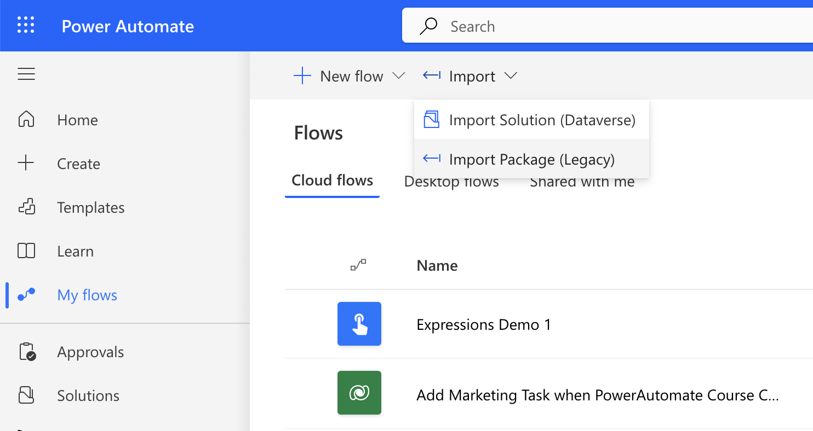
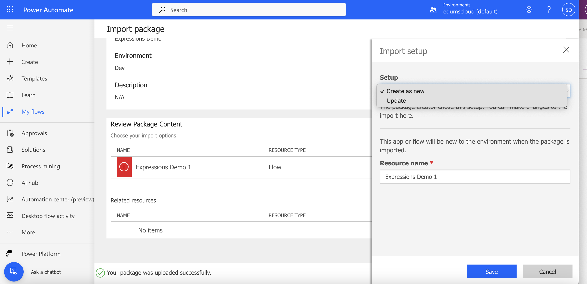
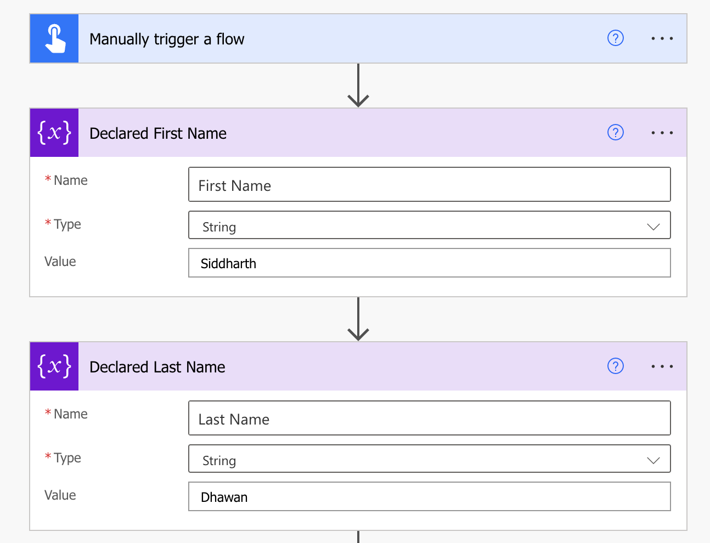
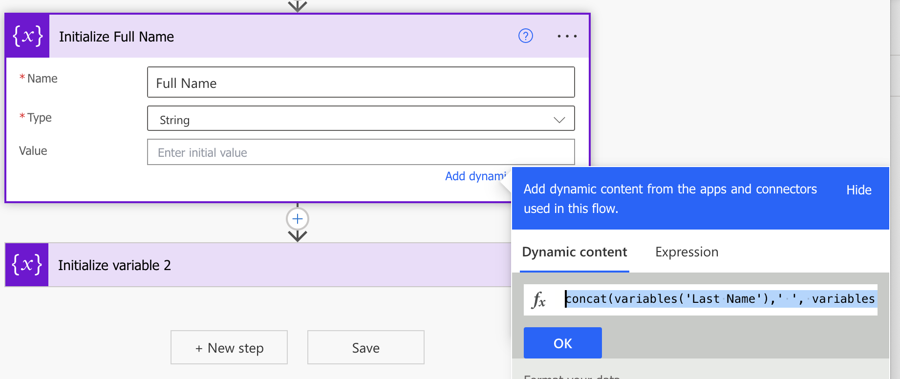
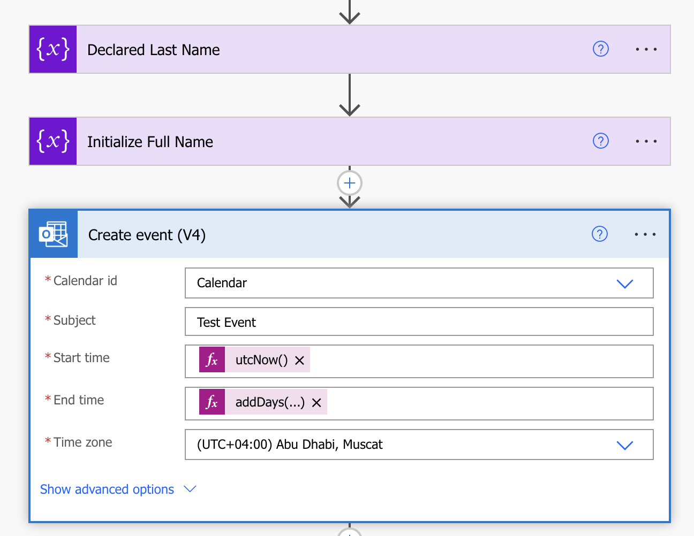
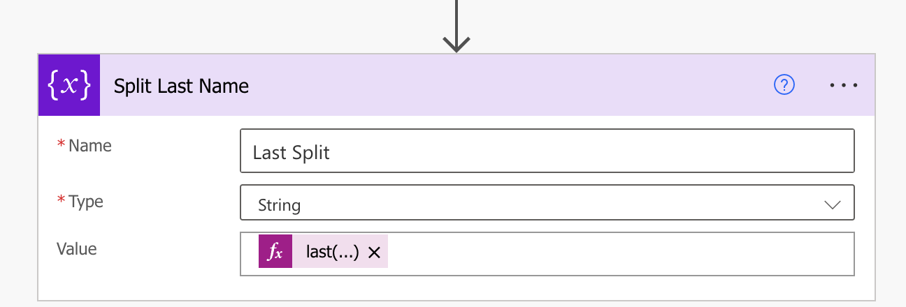
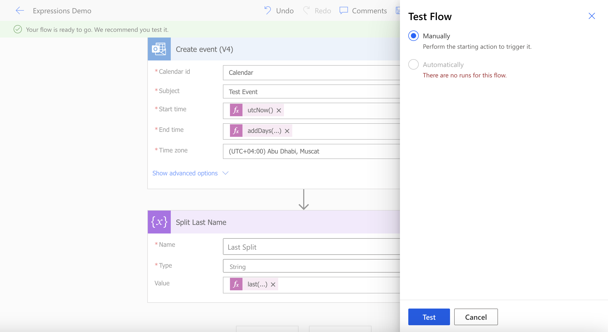

# Expressions Demo

When you build a flow in Power Automate, it's easy to get started by adding a trigger and actions and then passing data between them with dynamic content. But, in most cases you need to perform more complex operations. You may want to do a calculation, to transform data for your solution, or access, convert, and compare values. To do these things, you can look to expressions.

In Power Automate, expressions are a set of simple functions that enable you to return data. Put simpler, you use expressions to write a formula to get your data the way you want it. Expressions allow you to do things like convert a date to UTC, divide two numbers, create that perfect string by combining fields, and much more all by using various functions.

Flows in Power Automate run on top of Azure Logic Apps. This is relevant because they both use all of the same functions. When you're searching the internet for solutions or reading documentation about Power Automate functions, it's common to end up looking at Logic Apps documentation. For example, the [Reference Guide](https://learn.microsoft.com/en-us/azure/logic-apps/workflow-definition-language-functions-reference/) of functions for Power Automate is hosted on the Logic Apps side of the documentation.

Through the rest of this module, you'll learn about the different types of functions and the syntax so you can start to use expressions in your flows.

## In this Lab

## Task 1

a. Import the flow [solution available](https://edumscloud-my.sharepoint.com/:u:/g/personal/siddharthdwn_edumscloud_onmicrosoft_com/EZOAz_W-Y2BBmOEZKi4ouK8BPbt0qeVG4FXFzP5Ktvbu-w?e=LRvt2B) in the resources section of this lab. Navigate to __My Flows__ > __Import__ > __Import Package (Legacy)__

b. Configure the flow in the import setup. Click on __Action__ > Select __Create as new__ under the __Setup__ dropdown.

> Notice in the imported flow that we used a __Manual trigger__. This allows you to have a simple setup for writing and testing your expressions without worrying about other inputs or actions.

c. Initialize the first name and last name by setting the __value__ field in the __First Name__ and __Last Name__ variables

d. Write the expression to concatinate the first and last name in the __Full Name__ variable.
* Expression: concat(variables('First Name'),' ', variables('Last Name'))

e. Add a new action to create an email calendar event.
- Calendar id: Calendar
- Subject: Test Event
- Start Time: utcNow()
- End Time: addDays(utcNow(),3)
- Time Zone: Your time zone

f. Initialize the variable __Last Split__ using the below expression:
Expression: last(split(variables('Full Name'), ' '))

g. __Save__ and __Test__ the flow __Manually__.

> Please ensure you sign in to the email connector before running the flow.
