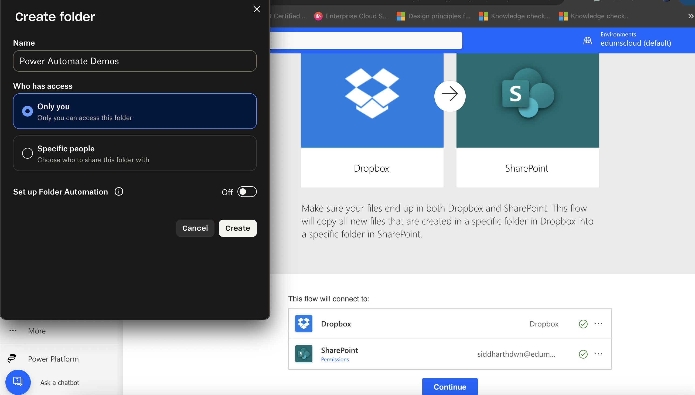
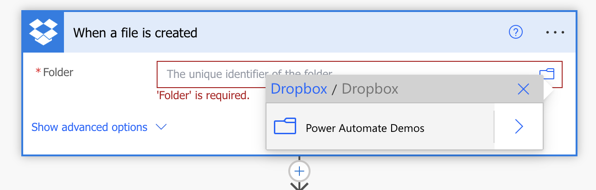
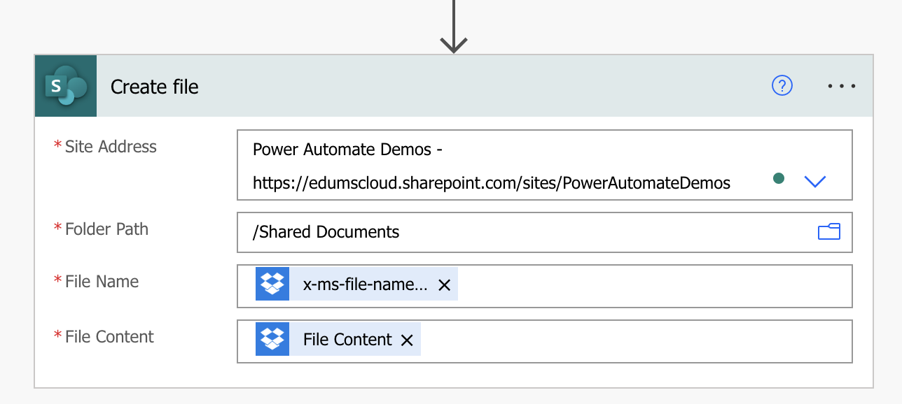
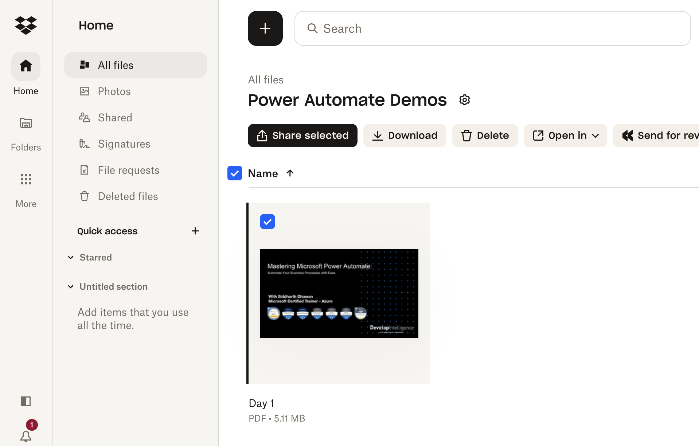
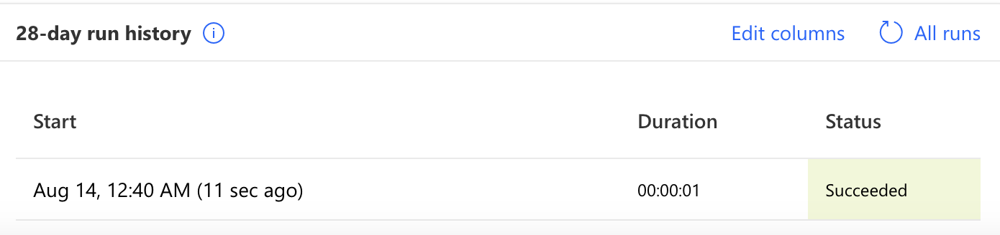
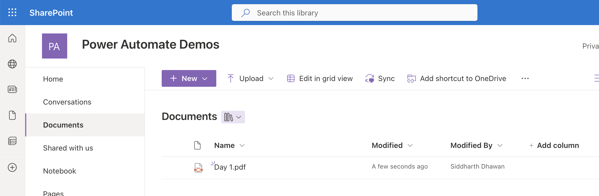

# Creating a Basic Copy flow using Power Automate Templates

A good way to get started is to use a template that is suited to your organization's scenario. You can choose from a collection of templates to find the one that best matches your scenario. Search all templates or browse by category to find your scenario, and then follow the steps in the template to create a cloud flow from the template.

You can tweak templates by adding, editing, or removing triggers and actions to create your own flows. You can copy paste actions in the same flow or across flows to speed up the your tweaks.

## In this Lab

In this lab, you will create a cloud flow using a Power Automate template that will automatically copy files from DropBox to SharePoint

* `Learning objectives`- Copy Flow using SaaS Connectors
* `Duration` - 20 minutes
* `Scenario` - A user or application uploads a file to DropBox or any other cloud storage. This file will automatically be copied into the SharePoint document library.
* `Prerequisites` - Each student must have a DropBox account using their personal IDs and access to SharePoint document library. The DropBox account must have a folder called Power Automate Demos.
* `Remarks` - The pdf file to be uploaded is available in the resources section of this lab.

## Task 1

Create a cloud flow from a template:
  a. Navigate to __Templates__ and search for __sharepoint dropbox__. Click on the first automated flow.

  
  

  b. Ensure all connections are authenticated. If not, please fix your connections. Click __Continue__.

  

  c. Update the values in the trigger. DropBox Folder Location: __Power Automate Demos__.
    
  

  d. Update the __Create File__ action
  
  - Site Address: https://edumscloud.sharepoint.com/sites/PowerAutomateDemos
  - Folder Path: /Shared Documents
  - File Name: x-ms-file-name
  - File Content: File Content
 
  

e. __Save__ the flow

## Task 2

Test the flow by uploading the pdf file (or any other file) to the DropBox folder __Power Automate_Demos_:
a. Navigate to your SharePoint list, for example, by clicking on the list name on the Quick Launch bar.

  

b. This will automatically trigger the flow.

c. Check the flow status. It should be running:

  

d. Verify if the file was copied by navigating to the shared documents in __Power Automate Demos__ SharePoint Site

  

e. Verify the flow run:

  
