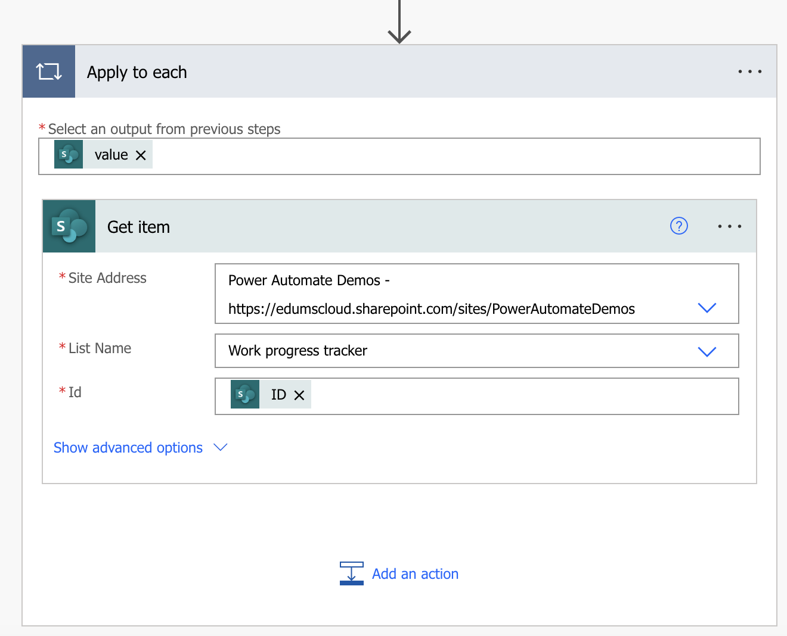

# Creating a Basic flow from Scratch using Power Automate - Reminder for overdue tasks!

## In this Lab

In this lab, you will create a cloud flow using a Power Automate template that will create an approval workflow when a SharePoint list item is created

* `Learning objectives`- Create a flow from scratch to run manually or on schedule
* `Duration` - 20 minutes
* `Scenario` - Send automated email reminders for overdue tasks in a SharePoint list
* `Prerequisites` - Each student must have a dedicated custom SharePoint list named __Work Progress Tracker__. The student will create this list in the first task of this lab.

## Task 1

Create your own custom SharePoint list using the following steps:
- Navigate to your SharePoint site. The site URL is https://edumscloud.sharepoint.com/sites/PowerAutomateDemos
- Create a new list __Work progress tracker__ available from Microsoft

  a. Click on __Home__ > __+ New__ > __List__ > __Work progress tracker__ > __Use Template__

    

  c. Populate this list with few items and assign to yourself
   
    

## Task 2

Create a cloud flow from scratch: 

a. Create a new Instant cloud flow and use a Manually trigger a flow as a trigger. Name it __Reminder for overdue tasks__. Click __Create__

b. Add a new step to get all items from the SharePoint list __Work Progress Tracker__.
- Search for __Get Items__ action
- Select the __Get Items__ from the SharePoint list of actions
- Site Address: https://edumscloud.sharepoint.com/sites/PowerAutomateDemos
- List Name: Work progress tracker

c. Add a new control connector and select __Apply to each__ control

d. We are going to loop on the list of values recieved from the previous step.

e. Click on __Add an Action__ and select __Get Item__ control for the SharePoint connector
- Site Address: https://edumscloud.sharepoint.com/sites/PowerAutomateDemos
- List Name: Work progress tracker
- Id: ID (from the Get Items action)

f. Add a __Condition__ control and check for the below conditions:
- if __Progress Value__ is __not equal to__ __Completed__
- if __Due Date__ __is less than__ __utcNow()__
> Please note that we have used an expression to compare the due date as this value is not available in the flow

g. Add an action under the __If Yes__ branch:
- Select __Send an email(v2)__ action
- To: __Assigned to Email__ from the dynamic content
- Subject: Your task is late!
- Body: __Title__ from the dynamic content

h. __Save__ the flow.

## Task 2

To test the flow, trigger it manually. Click on __Run__ > __Continue__ > __Run Flow__ > __Done__. This will send an email for all the tasks which are overdue.

Verify the email.

