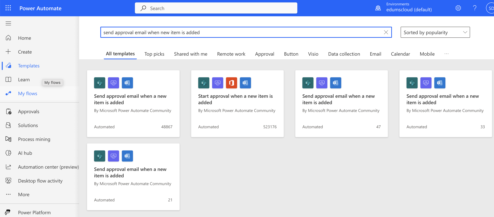
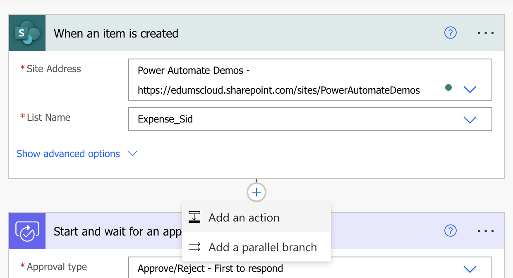
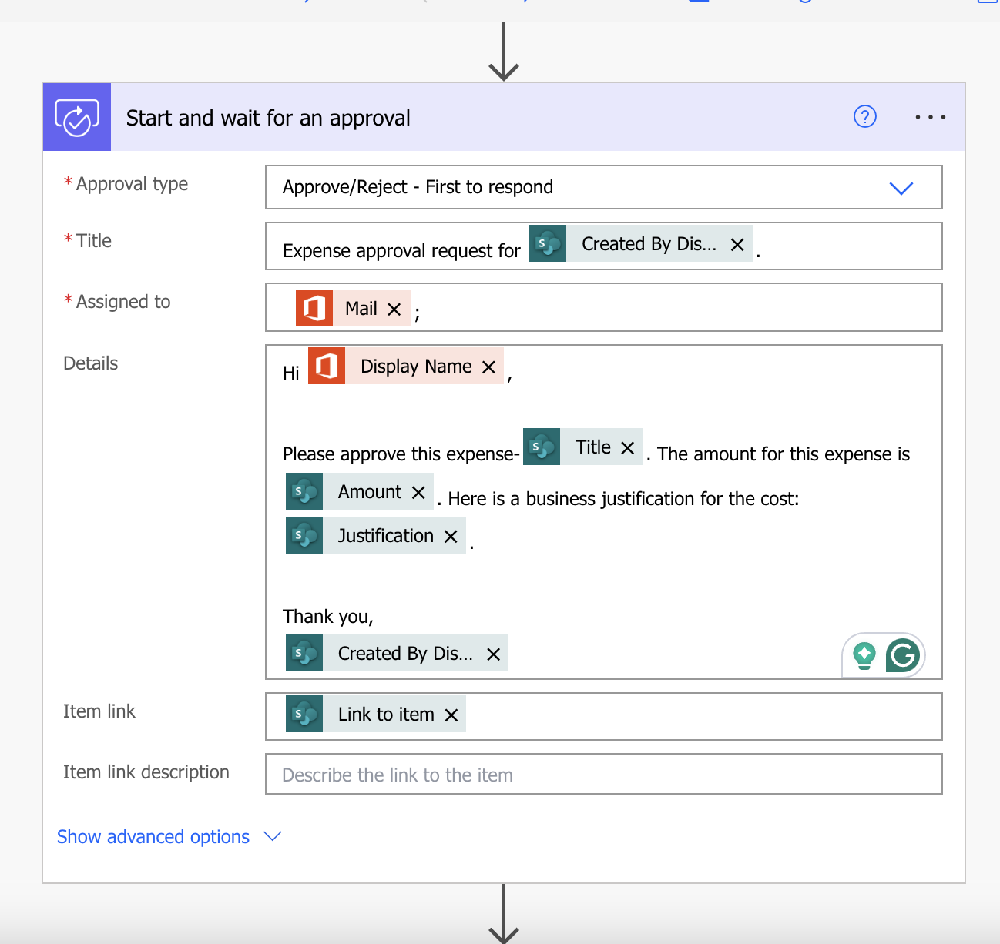

# Creating a Basic flow using Power Automate Templates

A good way to get started is to use a template that is suited to your organization's scenario. You can choose from a collection of templates to find the one that best matches your scenario. Search all templates or browse by category to find your scenario, and then follow the steps in the template to create a cloud flow from the template.

You can tweak templates by adding, editing, or removing triggers and actions to create your own flows. You can copy paste actions in the same flow or across flows to speed up the your tweaks.

## In this Lab

In this lab, you will create a cloud flow using a Power Automate template that will create an approval workflow when a SharePoint list item is created

* `Learning objectives`- Approvals and conditions
* `Duration` - 30 minutes
* `Scenario` - A user stores purchase information in a SharePoint list named Purchase Approvals. When a new purchase request is created, a flow is triggered and asks a manager/user to Approve/Reject.
* `Prerequisites` - Each student must have a dedicated custom SharePoint list named Expense_<name>. The list must have four fields: Title, Amount (currency), Justification (multiple lines) and Status (single line of text). The student will create this list in the first task of this lab.
* `Remarks` - the first time approval is created in an environment, the system provisions the infrastructure (approval system tables are made in the internal database, which is Dataverse) needed for the approvals. Therefore, the first approval may take some time to appear.

## Task 1

Create your own custom SharePoint list using the following steps:
- [Expense List](resources/Expense_Sid.csv) - Download this sample list for your reference
- Navigate to your SharePoint site. The site URL is https://edumscloud.sharepoint.com/sites/PowerAutomateDemos
- Import a SharePoint list

  a. Click on __Home__ > __+ New__ > __List__

    

  b. Click on __From CSV__

    

  c. Upload __Expense_Sid.csv__ from the resources of this lab and customize the list
    
    
  
  d. Rename the list as __Expense_your-name__. Click on __Create__.

    

## Task 2

Create a cloud flow from a template:
  a. Navigate to __Templates__ and search for __send approval email when new item is added__. Click on the first automated flow.

  

  b. Ensure all connections are authenticated. If not, please fix your connections. Click __Continue__.

  

  c. Update the values in the trigger. Site address: __https://edumscloud.sharepoint.com/sites/PowerAutomateDemos__ and List Name: __Expense_your-name__
    
  

  d. Customize the template to add a new action after the trigger. Click on the __+__ button followed by __Add an Action__.
  
  

  e. Search for __Get my profile__ and select __Get my profile(v2)__ from the action list
  
  

  f. Update the next action __Start and wait for approval__. 
- Approval Type: Approve/Reject - First to respond
- Title: Expense approval request for __Created by Display Name__
- Assigned To: __Mail__ from __Get my profile__ action
- Details: Details to me mentioned in the approval request including the dynamic content - __Diaplay Name__, __Title__, __Amount__, __Justification__, and __Created By Display Name__ 
- Item Link: Dynamic content from __Link to Item__
  
  !

  g. Edit __Apply for each__ control flow.

 >If approve response is __Approve__, edit the __Send an email(v2)__ action as below
  
- To: __Created by Display Name__
- Subject: Expense clain for Item:__Title__approved!
- Body: Email body with dynamic content - __Created by Display Name__, __Title__, __Display Name__ 

  

> If approver response is __Reject__, add a __Send an email(v2)__ action as below:

  

h. Update the status of expense claim in the Sharepoint List

>If approve response is __Approve__, update the status as __Approved__ and __Rejected__ if approve response is __Rejected__

  

i. __Save__ the flow

## Task 3

Test the flow by adding an expense item to the SharePoint list using the following steps:
a. Navigate to your SharePoint list, for example, by clicking on the list name on the Quick Launch bar.

b. Click __New__ and complete the form similar to the following screenshot (keep the Status field empty):
 
  

c. Save the new record, which will automatically trigger the flow.
e. Check the flow status. It should be running:
 
  

f. Click the running flow to see the progress of this instance of the flow:

  

g. Approve or reject the expense claim request by either __making a selection on your email__ or in the __Approvals Centre__

  

h. Approve or Reject, and once the approval/rejection is completed, check the status value in the list.

  

## Optional exercise if time permits:
### Amend the flow to automatically approve the expense If the amount is smaller than $500; otherwise, the expense item will progress through the approval process.
