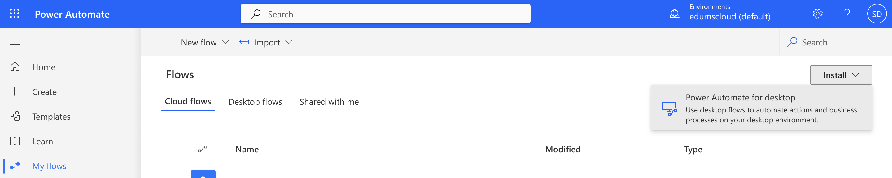
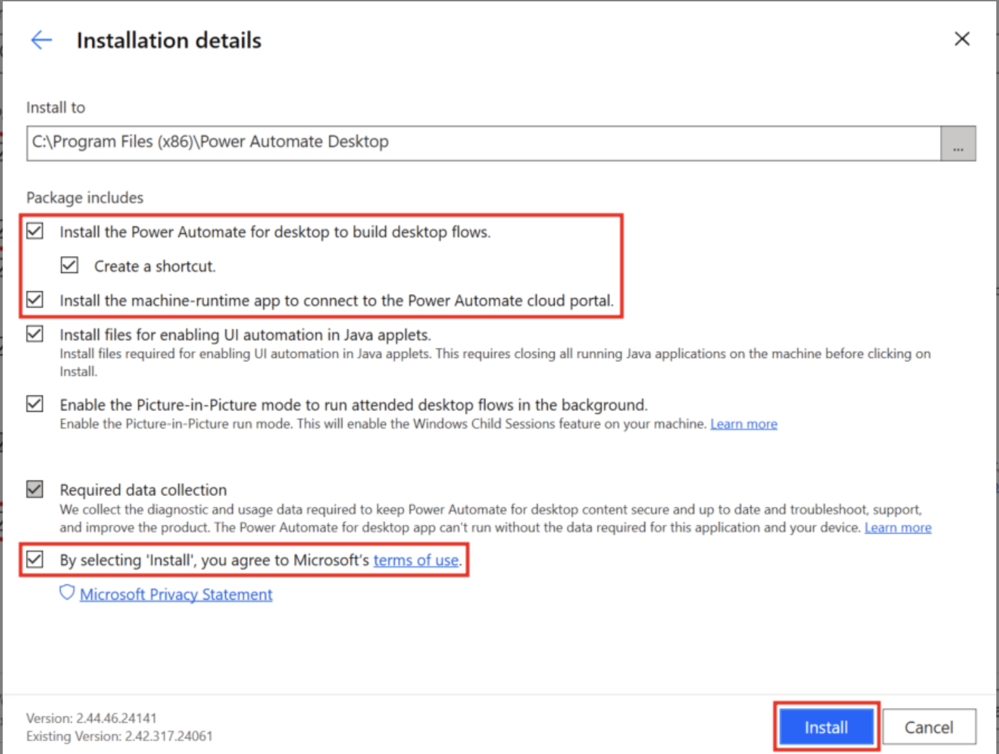
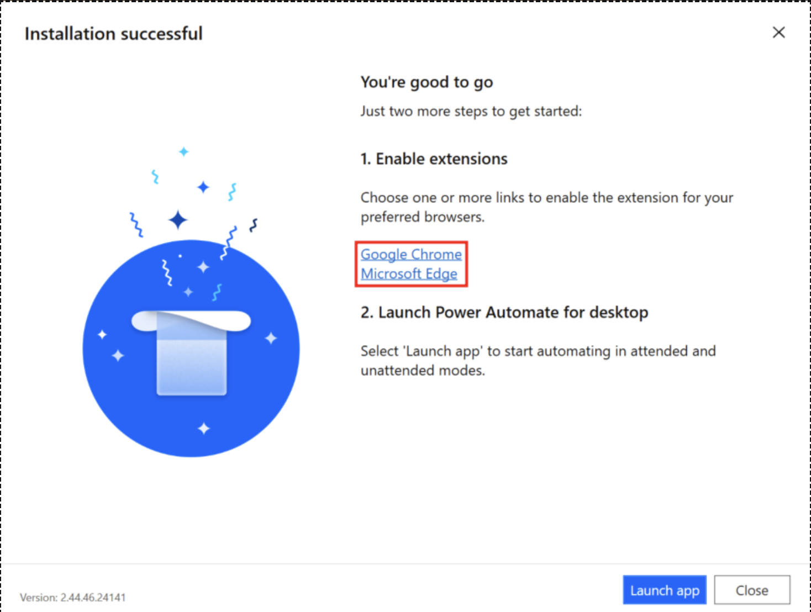
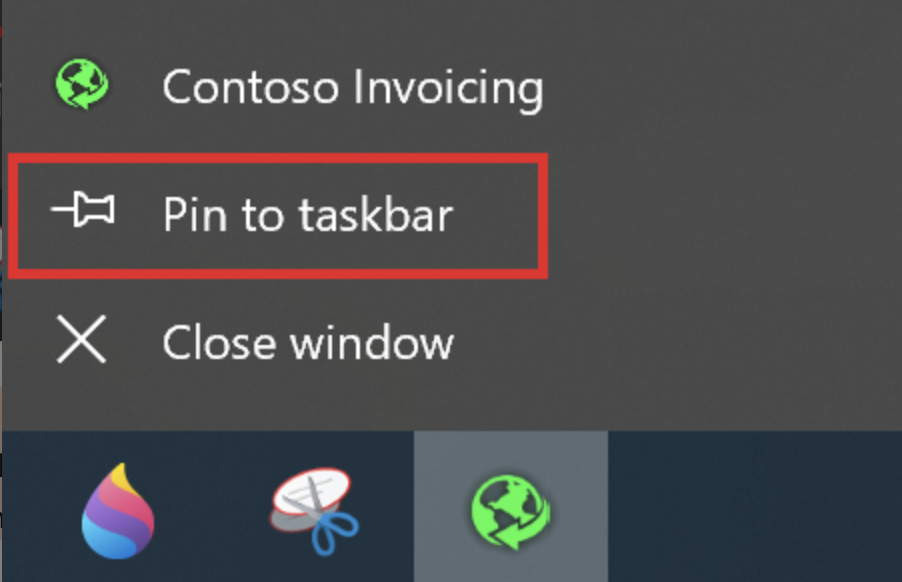

# Creating a Desktop Flow - Working with a legacy application

Desktop flows broaden the existing robotic process automation (RPA) capabilities in Power Automate and enable you to automate all repetitive desktop processes. Automating is quicker and easier than ever with the new intuitive Power Automate desktop flow designer using the prebuilt drag-and-drop actions or recording your own desktop flows to run later.

Desktop flows are addressed to essentially everyone who is performing simple or complex rule-based tasks on their workstations. Users at home, small businesses, enterprises, or larger companies can leverage automation capabilities in Power Automate to create flows, interact with everyday tools like email and Excel, or work with modern and legacy applications. Examples of simple and complex tasks you can automate are:

* Quickly organize your documents using dedicated files and folders actions
* Accurately extract data from websites and store them in Excel files using web and Excel automation
* Apply desktop automation capabilities to put your work on autopilot

## In this Lab
In this lab, we will create a Desktop flow to work with a legacy application that generates invoices.

* `Learning objectives`- Desktop Flows
* `Duration` - 90 minutes
* `Scenario` - Globomantics has a need to automate a business process around creating invoices – however, the process uses a legacy application with no APIs.	You need to automate invoice creation in the legacy invoicing application using robotic process automation.
* `Prerequisites` - Each student must have:
    - A [Power Apps Developer Plan](https://www.microsoft.com/en/power-platform/products/power-apps/free) enabled  
    - Install the Power Automate for desktop application. 
    - Install the [legacy invoicing application](/labs/rpa/desktopflow/resources/ContosoInvoicingSetup.zip) provided in the resources of this lab
    - This will be done in the first task of this lab.

## Task 1

In this task, we will ensure that all pre-requisites to run desktop flows are met.

a. [Get Power Apps Developer Plan](https://www.microsoft.com/en/power-platform/products/power-apps/free) - This step was completed during __Day 1__ prerequisites.

b.  __Install the Power Automate for desktop application__ - Go to https://powerautomate.microsoft.com/ and sign in with the account that you're using for the labs.

- Select My flows from the left menu.

- Select the Install dropdown menu to the right of the screen and then select __Power Automate for desktop__.

- After the download completes, select the __.exe__ file to open and run the installer: __Setup.Microsoft.PowerAutomate.exe__. Within the Install Power Automate package dialog, select the __Next__ button.

- Select the checkboxes to __agree to Microsoft's terms of use__ and __installing both Power Automate for desktop and the machine-runtime app__ and then select the __Install__ button.

- The installer installs the following components on your computer:
    - Power Automate for desktop app
    - Power Automate for desktop browser extension for Microsoft Edge Chromium and Google Chrome
    - Power Automate machine-runtime management app

- After the installation is finished, select the __hyperlinks__ in step 1 within the __Installation successful__ dialog to navigate to a chosen browser(s) to enable Power Automate for desktop extensions. After your extensions are set up, you can launch Power Automate for desktop in step 2 within the __Installation successful__ dialog.

c. Download and Install the [legacy invoicing application](/labs/rpa/desktopflow/resources/ContosoInvoicingSetup.zip) provided in the resources of this lab. 

- After the installation is fully complete, launch the Contoso Invoicing app from the Start menu by using the search bar in the lower part of your Windows desktop. Within the search bar, type Contoso Invoicing.

- Right-click the app icon located in the lower task bar of your desktop and then select the option to pin the app icon to the task bar for quick launch. You use this app in subsequent labs, for the Process advisor and the robotic processing automation recordings.

- Next, spend some time getting familiar with the Contoso Invoicing app. These steps explore how the Contoso Coffee shop employee manually enters a new invoice record into the company application system when a new invoice is received. This exercise helps you better prepare for the following lab exercises.

