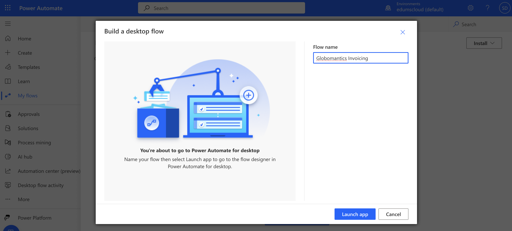
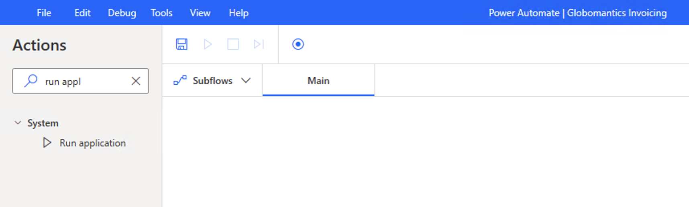
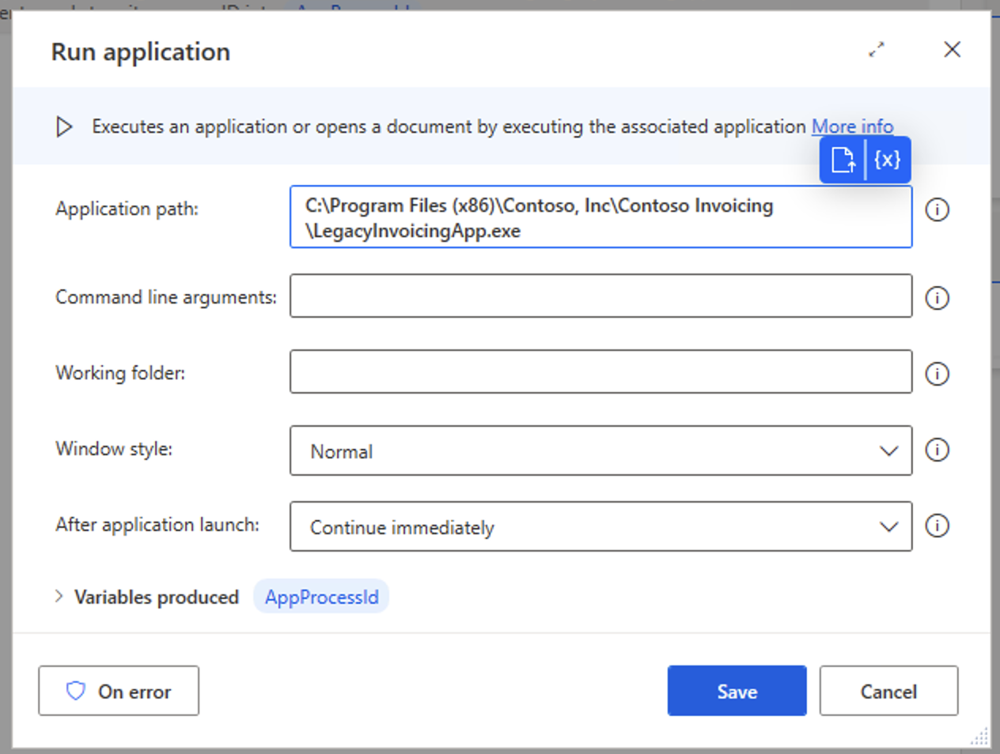
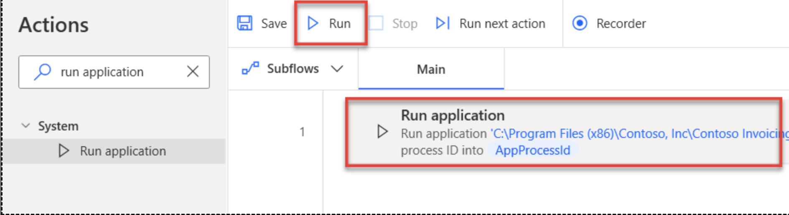
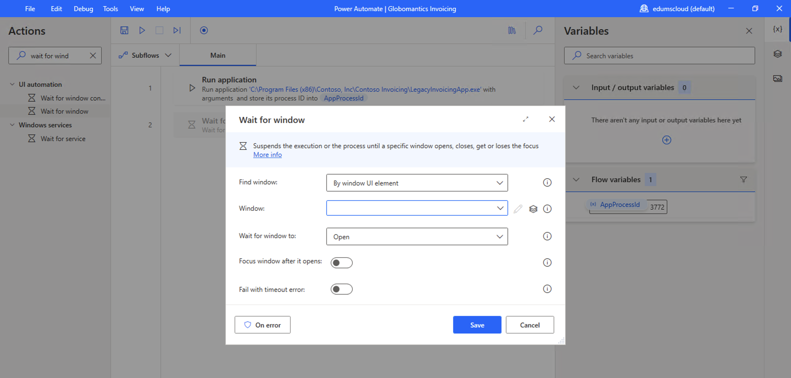
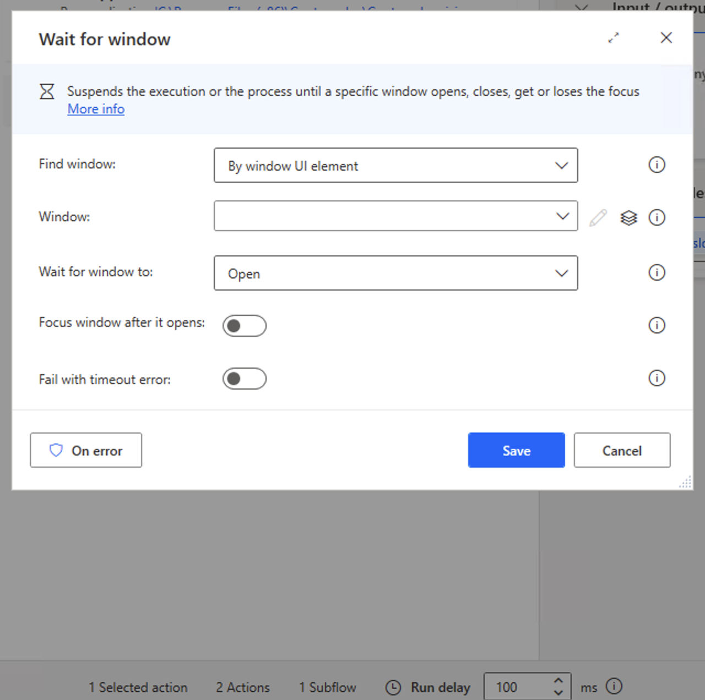
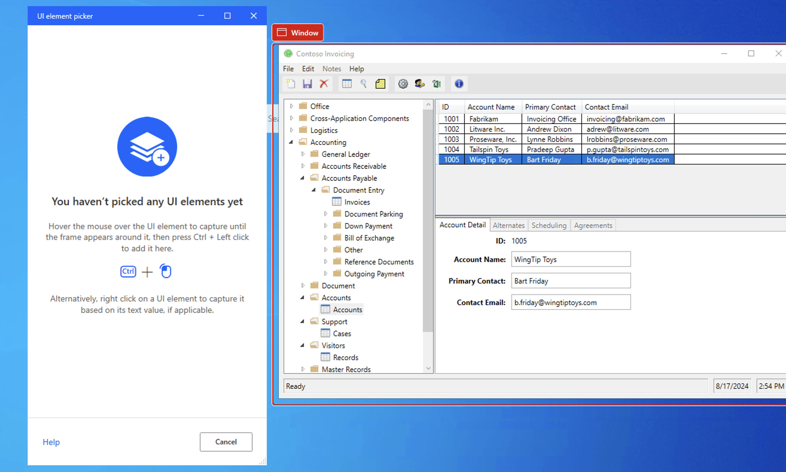
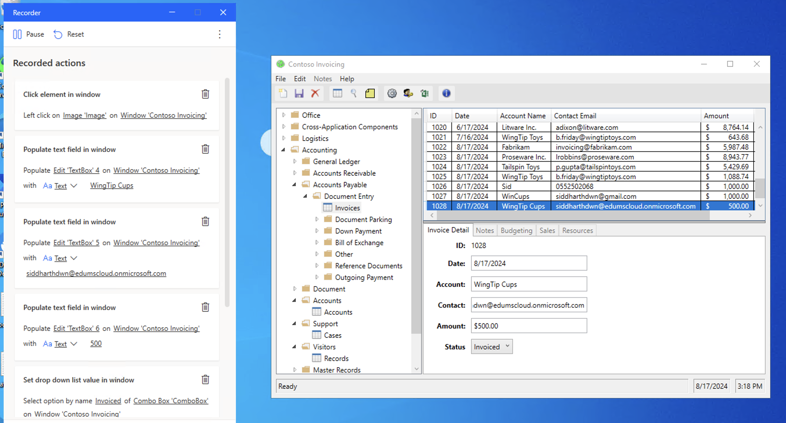
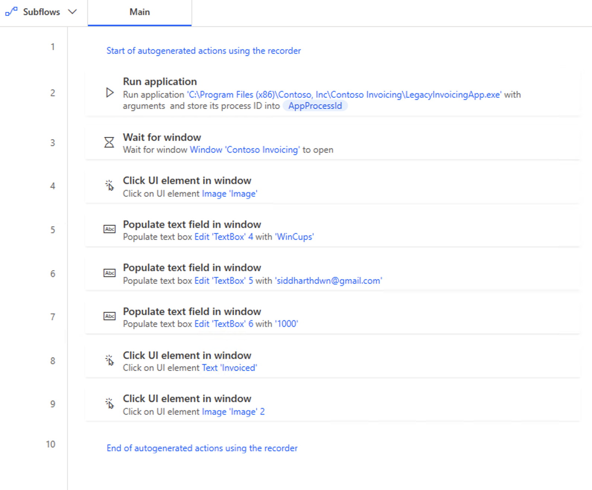

# Creating a Desktop Flow - Working with a legacy application

Desktop flows broaden the existing robotic process automation (RPA) capabilities in Power Automate and enable you to automate all repetitive desktop processes. Automating is quicker and easier than ever with the new intuitive Power Automate desktop flow designer using the prebuilt drag-and-drop actions or recording your own desktop flows to run later.

Desktop flows are addressed to essentially everyone who is performing simple or complex rule-based tasks on their workstations. Users at home, small businesses, enterprises, or larger companies can leverage automation capabilities in Power Automate to create flows, interact with everyday tools like email and Excel, or work with modern and legacy applications. Examples of simple and complex tasks you can automate are:

* Quickly organize your documents using dedicated files and folders actions
* Accurately extract data from websites and store them in Excel files using web and Excel automation
* Apply desktop automation capabilities to put your work on autopilot

## In this Lab
In this lab, we will create a Desktop flow to work with a legacy application that generates invoices.

* `Learning objectives`- Desktop Flows
* `Duration` - 45 minutes
* `Scenario` - Globomantics has a need to automate a business process around creating invoices – however, the process uses a legacy application with no APIs.	You need to automate invoice creation in the legacy invoicing application using robotic process automation.
* `Prerequisites` - Each student must have:
    - A [Power Apps Developer Plan](https://www.microsoft.com/en/power-platform/products/power-apps/free) enabled  
    - Install the Power Automate for desktop application. 
    - Install the [legacy invoicing application](/labs/rpa/desktopflow/resources/ContosoInvoicingSetup.zip) provided in the resources of this lab
    - This will be done in the first task of this lab.

## Task 1

In this task, we will ensure that all pre-requisites to run desktop flows are met.

a. [Get Power Apps Developer Plan](https://www.microsoft.com/en/power-platform/products/power-apps/free) - This step was completed during __Day 1__ prerequisites.

b.  __Install the Power Automate for desktop application__ - Go to https://powerautomate.microsoft.com/ and sign in with the account that you're using for the labs.

- Select My flows from the left menu.

- Select the Install dropdown menu to the right of the screen and then select __Power Automate for desktop__.

- After the download completes, select the __.exe__ file to open and run the installer: __Setup.Microsoft.PowerAutomate.exe__. Within the Install Power Automate package dialog, select the __Next__ button.

- Select the checkboxes to __agree to Microsoft's terms of use__ and __installing both Power Automate for desktop and the machine-runtime app__ and then select the __Install__ button.

- The installer installs the following components on your computer:
    - Power Automate for desktop app
    - Power Automate for desktop browser extension for Microsoft Edge Chromium and Google Chrome
    - Power Automate machine-runtime management app

- After the installation is finished, select the __hyperlinks__ in step 1 within the __Installation successful__ dialog to navigate to a chosen browser(s) to enable Power Automate for desktop extensions. After your extensions are set up, you can launch Power Automate for desktop in step 2 within the __Installation successful__ dialog.

c. Download and Install the [legacy invoicing application](/labs/rpa/desktopflow/resources/ContosoInvoicingSetup.zip) provided in the resources of this lab. 

- After the installation is fully complete, launch the Contoso Invoicing app from the Start menu by using the search bar in the lower part of your Windows desktop. Within the search bar, type Contoso Invoicing.

- Right-click the app icon located in the lower task bar of your desktop and then select the option to pin the app icon to the task bar for quick launch. You use this app in subsequent labs, for the Process advisor and the robotic processing automation recordings.

d. Next, spend some time getting familiar with the Contoso Invoicing app. These steps explore how the Contoso Coffee shop employee manually enters a new invoice record into the company application system when a new invoice is received. This exercise helps you better prepare for the following lab exercises.

## Task 2

a. Create a new Desktop flow by clicking on __My Flows__ > Under __Desktop Flows__ > Click __+ New Desktop Flow__ > Click __Launch App__. If you're presented with a dialog that wants to open Power Automate, select the __Always__ allow checkbox and then select __Open Power Automate__ to open the Power Automate for desktop app.

b. When you're in the Power Automate for desktop app designer, in the search bar in the __Actions__ pane, enter __run application__ and then double-click the __Run application__ action.

c. Within the Run application dialog, for the __application path__ parameter, go to and select the location path of the Contoso Invoicing app under __Application path__. (This action opens the Contoso Invoicing app when you're running your flow). Usually, you can find this parameter under __C:\Program Files (x86)\Contoso, Inc\Contoso Invoicing\LegacyInvoicingApp.exe__; however, the path might be different on your computer.

d. Select the __Save__ button in the lower-right corner of the dialog. Now you have one action in your flow that opens the Contoso Invoicing app. You can select the Run button to quickly test your flow.

> Note: Minimize the invoicing application as it is required in the next step in our desktop flow.

e. Now we want to wait for the application to load before the flow does anything else. When you're in the Power Automate for desktop app designer, in the search bar in the __Actions__ pane, enter __wait for window__ and then double-click the __Wait for window__.

f. In the __Wait for window__ dialog, select __Window__ > __Add UI Element__ >

g. Organize the UI Selector and the Contoso Invoicing app windows side by side. Select the __Contoso Invoicing__ app window by clicking __CTRL + left click__.

h. Now you have two actions in your flow that opens the Contoso Invoicing app. You can select the Run button to quickly test your flow.

> Note: Minimize the invoicing application as it is required in the next step in our desktop flow.

## Task 3

a. Minimize the Contoso Invoicing app manually and then select __Recorder__.

> __Tip__: Now, you can start recording. We recommend that you get familiar with the following steps until the recording is done. As a result, you can finish the recording in one instance without manually going back and forth. If your first few recordings aren't acceptable, you can delete the recording afterward by selecting the ellipsis (...) menu and then practice more until you have an acceptable recording.

> __Tip__: To help with the resilience of UI automation playbacks, we recommend that you minimize other apps from your desktop.

- Reopen the Contoso Invoicing app and then select the Record button from the Recorder dialog.
- In the Contoso Invoicing application, select Invoices from the left menu.
- Create a new record by selecting the __New record__ icon from the ribbon in the upper left of the screen.
- Use these sample values to complete the recording (you can also use any arbitrary values):

    - Date - Current date
    - Account - WingTip Cups
    - Contact - your email address
    - Amount - $500
    - Status - Invoiced
- Select the Save icon from the ribbon in the upper left of the screen to keep your changes.
- Select the Done button at the bottom of the Recorder and then close the Contoso Invoicing app.

> __Note__: The action of closing the app hasn't been recorded for simplicity purposes. The reason is so that you can view the result because the Contoso Invoicing app remains open after you test the desktop flow. In a real-world use case, you can decide whether to record the closing action or not.

> __Note__: By default, the desktop flow launches a new instance of the app whenever it runs. Even if you leave the app open, the next desktop flow run launches another new app window. You can also change this behavior to only attach to an existing app instead of launching another new instance from the portal (more details are provided in the following steps).

b. Within the Power Automate for desktop app, you can view the recorded script of each step. You can edit each step by selecting the __ellipsis (...)__ icon to the right of the title and then by selecting Edit from the options list. You can also double-click each step to view the options list.

> __Tip__: You can also select the ellipsis (...) and then select the Delete option from the list to remove duplicate steps or the entire script.

c. You can select the __Run__ icon at the top of the screen to play back and test your flow. Don't interact with your device during testing. The recording will play back successfully.

d. You can rename UI elements to better match the purpose and define each uniquely by right-clicking on the element, where you can select rename.

e. Select the __Save__ icon in the upper part of the screen to save the desktop flow.

