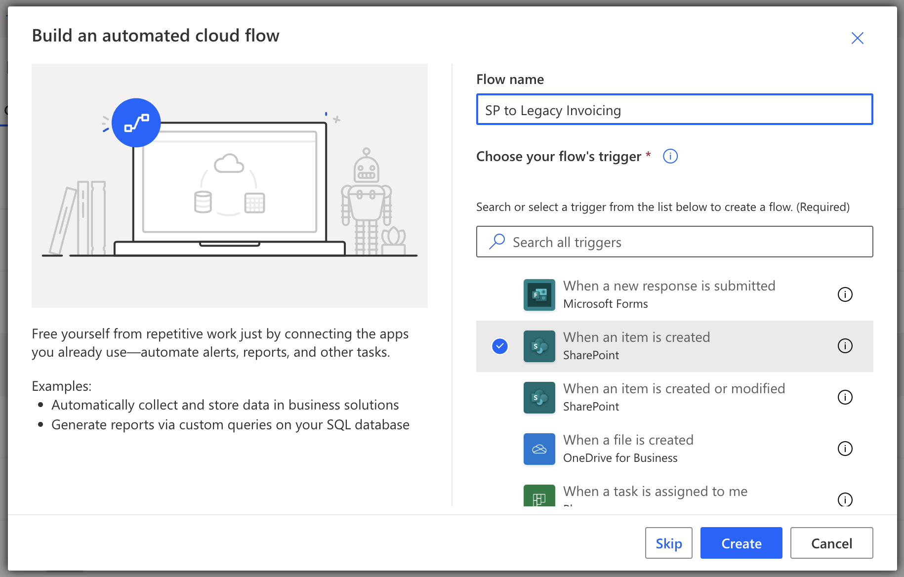
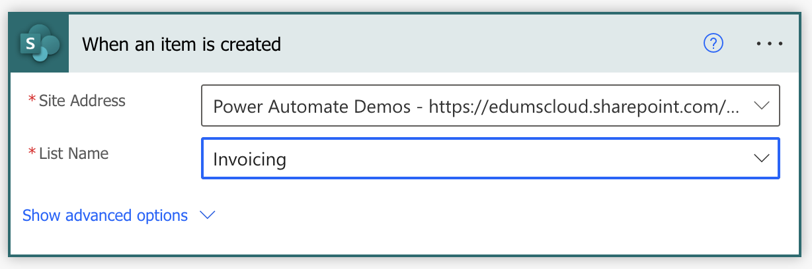
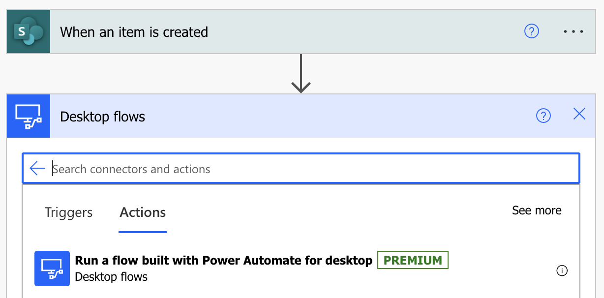
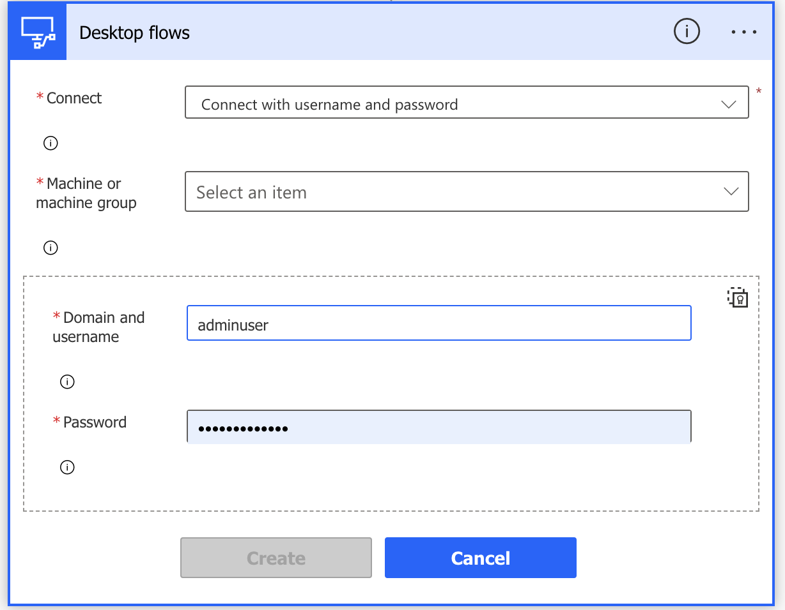
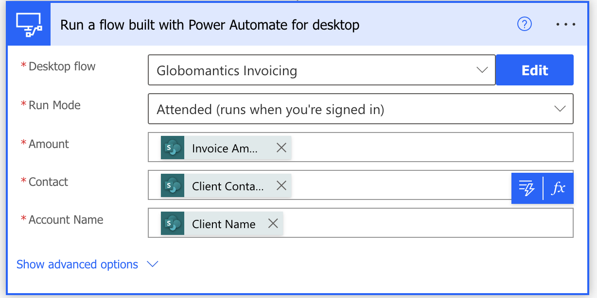
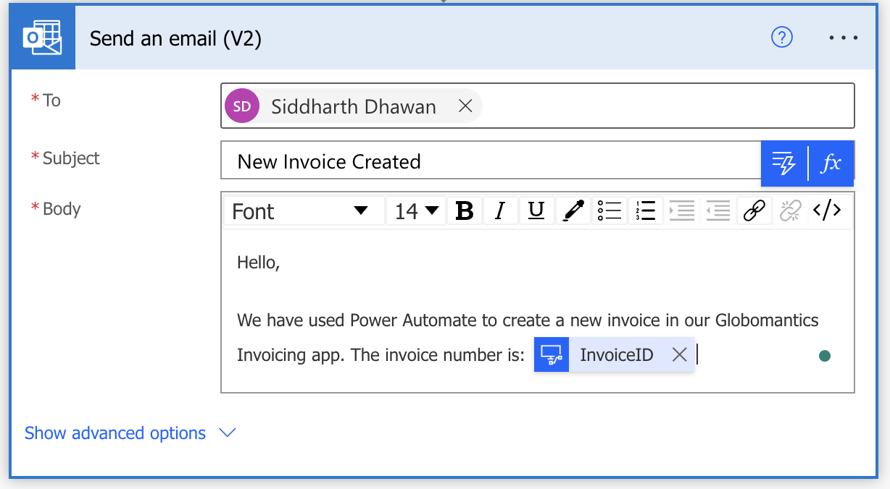
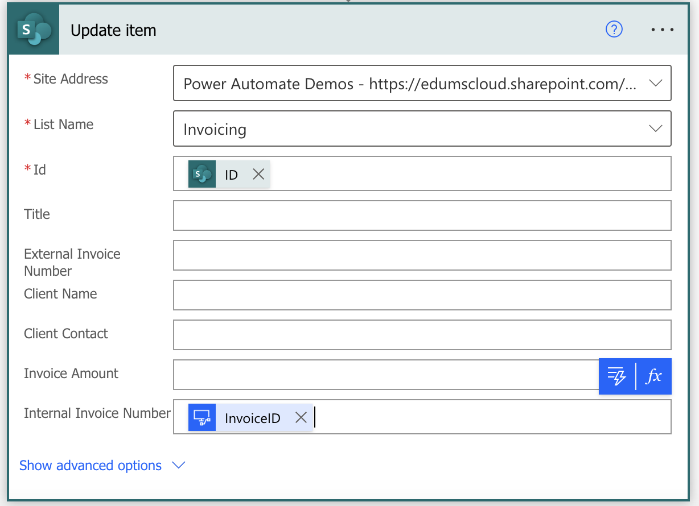

# Calling a Desktop flow from a Cloud Flow

In a previous lab, you created a sample cloud flow that can run a desktop flow on your computer and then enter the invoice information for Globomantics. However, you'll need to manually trigger that cloud flow to run every time. The Globomantics Corp. uses SharePoint Lists to store invoicing information. Therefore, your next task is to build a new cloud flow that automatically triggers whenever a new list item is created. To do so, you'll need to use an Outlook connector in the cloud flow.

## In this Lab

You'll complete the following tasks in this lab:

- Create a new solution to package the end-to-end invoice processing solution.
- Create a new cloud flow that initiates the invoicing process through when a new SP list item is created.
- Integrate the desktop flow from the [desktop flow](/labs/rpa/desktopflow/README.md) into the cloud flow.
- Perform a test run of the new cloud flow.
- `Duration`: 40 minutes
- `Prerequisites` - Each student must have a dedicated custom SharePoint list named [Invoicing](https://edumscloud-my.sharepoint.com/:x:/g/personal/siddharthdwn_edumscloud_onmicrosoft_com/ERTZ-0e-FsBPgV06nvKdujEBy9_QE3jj0EGEe8S3D5PYlQ?e=bAcRdD). This list can be imported from the resources section of this lab.

## Task 1

a. Let's start by creating a new cloud flow:
- Trigger: When an item is created

- Site Address: https://edumscloud.sharepoint.com/sites/PowerAutomateDemos
- List Name: Invoicing

b. Add a new action __Run a flow with Power Automate for for desktop__

c. Configure the connection:
- Connect : Connect with username and password
- Machine or Group Name: your-machine-name
- Username: your-username
- Password: your-password

d. Configure the action:

e. Add a __Send an email(v2)__ action:

f. Update the SharePoint list and pass the __Internal Invoice Number__ dynamically:

g. __Save__ and __test__ the flow by adding a new item to the __Invoicing__ list.
